# Specifikáció és követelménymenedzsment

## 1. Specifikáció

Célja a feladatot megoldó szoftver funkcióinak tisztázása, a rendszerre és a fejlesztésre vonatkozó elvárások megadása

Feltérképezi a követelményeket felhasználói, valamint fejlesztői szemszögből, lépései:
- megvalósíthatósági elemzés
- követelmény feltárás és elemzés
- követelmény specifikáció
- követelmény validáció

Eredménye a szoftver követelmény-leírás (software requirements specification)

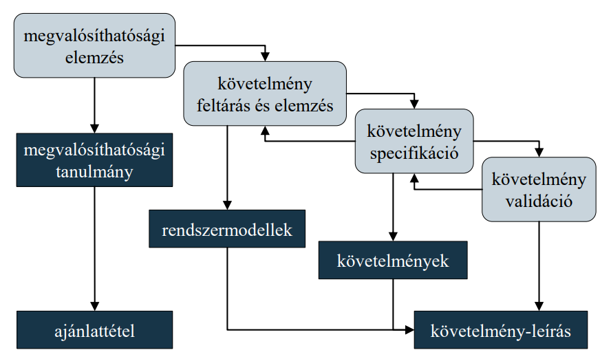

### 2.1 Példaprojekt

Készítsük el Kati kávézójának eladási nyilvántartását végigkövető programot.
- a kávézóban 3 féle ital (kávé, tea, limonádé), illetve 3 féle étel (csokitorta, palacsinta, sajttorta) közül lehet választani
- az ételek és italok ezen belül különfélék lehetnek, amelyre egyenként lehet árat szabni, és elnevezni
- a program kezelje a rendeléseket, amelyekben tetszőleges tételek szerepelhetnek, illetve a rendelés kapcsolódhat egy törzsvásárlóhoz
- biztosítsunk lehetőséget rendelések lekérdezésére, valamint napi, havi adatokra összesített nettó/bruttó fogyasztási statisztikák követésére

## 2. Megvalósíthatósági elemzés

A megvalósíthatósági elemzés (feasibility study) azt vizsgálja, hogy a szoftver megvalósítható-e, és üzletileg megtérül-e a befektetés, ezen belül:
- milyen (humán, hardver, szoftver) erőforrások szükségesek, és ezek rendelkezésre állnak-e
- mi a megvalósítás költsége, időtartama
- a fejlesztést követően a szoftver igényel-e üzemeltetést, karbantartást, és ez milyen feladatokat és költségeket jelent
- az elemzést gyorsan, alacsony költségek mellett kell elvégezni
- amennyiben a fejlesztett szoftver egyedi, az elemzést ajánlattétel követi a vevők számára

### 2.1 Példa
- Humán erőforrások: egy termékgazda (5 óra), egy tervező/fejlesztő (25 óra), egy tesztelő (5 óra)
- Hardver erőforrások: egy fejlesztői, egy tesztelői számítógép
- Szoftver erőforrások: fejlesztőkörnyezet (Eclipse), verziókövető (Git), projektvezető oldal (Redmine)
- Üzemeltetés: a betanítást követően további támogatás nem szükséges
- Karbantartás: éves rendszerességgel ellenőrzés, rendszerkövetés
- Megvalósítás időtartama 35 emberóra, költsége x Ft
	
## 3. Követelmény feltárás és elemzés

A követelmények feltárása és elemzése (requirements elicitation and analysis) során követelményeket állapítunk meg, három lépésben:

1. kutatás: meglévő rendszerek tanulmányozása (as-is analysis), egyeztetés, interjúk az érdekeltekkel (stakeholder analysis), kezdeti követelmények meghatározása
  - elsősorban a termékgazda, üzleti elemző feladata
  - érdekeltek azok, akik bármilyen módon kapcsolódnak a szoftverhez (használó, üzemeltető, üzleti partner, jogalkotó, ellenérdekelt)
  - célszerű közösen, kontrollált körülmények között egyeztetni az érdekeltekkel (joint requirements development)
  - nem csupán a követelményeket, de azok okait is felderíti
  
2. osztályozás: a követelmények rendezése, csoportosítása, alrendszerekhez történő besorolás (tervezést igényel)

3. prioritizálás: fontossági sorrend felállítása, ütközések feloldása, szükségtelen, vagy megvalósíthatatlan követelmények elhagyása
  - a MoSCoW módszer négy kategóriát használ: szükséges(Must have), fontos (Should have), lehetséges (Could have), nem támogatott (Won’t have)
  - A követelmények alapján létrehozhatóak a rendszer modelljei, prototípusai, pl.:
  - felhasználói felület terv (wireframe mockup), menürendszer terv
  - egyszerűsített vizuális megjelenítés, animáció

### 3.1 Nehezítő tényezők

A követelmények feltárását és leírását számos tényező nehezítheti
- az érdekeltek bizonytalanok az elvárásoknak
- az érdekeltek nem egyértelműen fejtik ki az elvárásokat
- az érdekeltek nem rendelkeznek informatikai ismeretekkel
- az érdekeltek nem közvetlenül a szoftver felhasználói, így afelhasználói igények eltérhetnek
- a fejlesztőnek nincs megfelelő szakmai ismerete
- a fejlesztő meglévő megoldásokhoz igyekszik adaptálni a követelményeket
- a fejlesztés a követelmények véglegesítése előtt megkezdődik
- a körülmények változhatnak a specifikáció során

### 3.3 Felületi tervek

Érdemes a felhasználói felületről is terveket készíteni, vázlatosan. Ehhez különböző eszközök használata ajánlott: Moqups, Balsamiq, Mockplus, Wireframe.cc, stb

Több típust lehet itt is megkülönböztetni:
- low fidelity wireframe
- high fidelity wireframe
- mockup

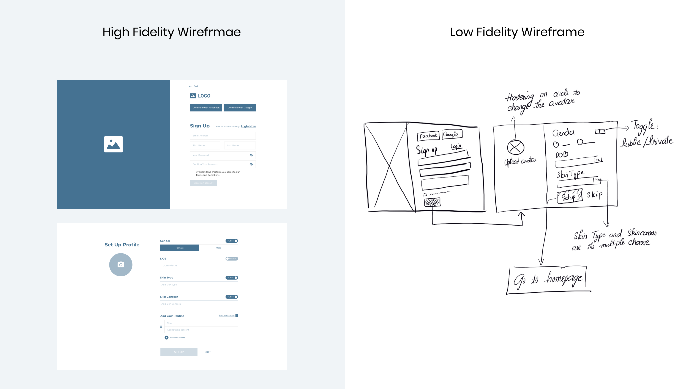

### 3.4 Követelmény típusok

A követelmények típusai:
- funkcionális: a szoftver által nyújtott szolgáltatások, reakciók, viselkedések leírása
- nem funkcionális: megszorítások a szolgáltatásokra, a viselkedésre
- termék követelmények: hatékonyság (teljesítmény, méret), megbízhatóság, biztonság, hordozhatóság, felhasználhatóság
- menedzselési követelmények: környezeti, működési, fejlesztési
- külső követelmények

#### 3.4.1 Termék követelmények

Hatékonyság (efficiency)
- a szoftver által a hardver erőforrásokra (processzor, memória, merevlemez, sávszélesség) való támaszkodás mértéke, amelyet a lehető legkisebbre kell szabni
- megbízhatóság (dependability):
- a szoftver által biztosított funkcionalitás garantálása (correctness) a környezetben bekövetkezett változások ellenére
- abban az esetben is, amennyiben azok nem felelnek meg a specifikációban elvárt követelményeknek (robustness)

Biztonság (security)
- a szoftverben által tárolt adatok védelmének mértéke az illetéktelen hozzáféréssel szemben
- hordozhatóság (portability):
- a szoftver kompatibilitásának mértéke különböző hardver és szoftver platformokkal, valamint az azokra történő átvitel könnyedségének mértéke
- felhasználhatóság (usability):
- a szoftver (használatának, telepítésének, üzemelésének) elsajátításának könnyedsége a különböző képzettségű és hátterű felhasználók számára
- akadálymentesség

#### 3.4.2 Menedzselési követelmények

Környezeti (environmental):
- a rendszer által igényelt hardver erőforrások (minimális, ajánlott)
- a rendszer használatához szükséges további szoftverek, amelyekkel együttműködik

Működési (operational):
- a felhasználás paraméterei (gyakoriság, időtartam, felhasználók száma, rendelkezésre állás mértéke)
- a felhasználók jellege (szaktudás, informatikai ismeretek)

Fejlesztési (development):
- a fejlesztés módszertana, programozási paradigmái, szükséges eszköztára (pl. fejlesztőkörnyezet)
- a felhasznált programozási nyelv(ek) és könyvtárak

#### 3.4.3 Külső követelmények

Minden, külső tényező által befolyásolt követelmény, pl.:
- jogszabályoknak történő megfelelés
- etikai kérdések a felhasználók adataival, és azok továbbadásával szemben
- tulajdonjogi kérdések a begyűjtött adatokkal, az esetleges külső fejlesztésekkel kapcsolatosan

### 3.5 Példa

#### Funkcionális követelmények

##### Rendelés
- új rendelés felvitele
  - ...
  
##### Statisztikák
- ...
  
#### Nem funkcionális követelmények

- egyszerű felhasználói felület
- kizárólag billenyűzet segítségével irányítható

#### Menedzselési követelmények

Környezeti
- nem működik együtt semmilyen külső szoftverrel, szolgáltatással

Működési
- általában rövid futási idő, maximum 1-2 óra
- gyakori használat

Fejlesztési
- Java nyelv, Eclipse fejlesztői környezet
- objektumorientált paradigma

#### Termék követelmények

Hatékonyság
- jelentéktelen terhelés a processzor részére, hálózatot nem igényel
- a memória, illetve merevlemez terhelés a bevitt adatok számával arányos, maximum 100 MB
- gyors (1 másodperc alatti) válaszidő minden bevitelre egy alsó kategóriás számítógépen a legtöbb funkcióra, de a statisztikák lekérése több időt vehet igénybe, az adatok számától függően

Biztonság
-  az adatok biztonsága nem garantált

## 4. Követelmény specifikáció

A követelmény specifikáció (requirements specification) az elemzés során kapott információt alakítjuk át egységes alakba
- a felhasználói szinten csak alapjaiban, a fejlesztői szinten részletesen megadjuk
-  a leírás történhet:
  - beszélt nyelven
  - formalizált leírással, pl. használat esetek, felhasználói történetek
  - formális matematikai leírással, pl. elő-/utófeltételek, axiómák
  - formális leírónyelvek segítségével, pl. PDL, PSL, SADT
  - metrikák segítségével
  
### 4.1 Használati esetek

A használati esetek (use case) diagramja azt ábrázolja, miként működik együtt a felhasználó a rendszerrel
- szabványos módja a funkcionális követelmények leírásának
- a hangsúlyt az érthetőségre helyezi, és általában egy részletes leírással társul (a pontosítás végett)

#### 4.1.1 Diagramelemek

A diagram elemei:
- aktor: a felhasználó, aki a rendszert
használja
- funkció: a rendszer egy szolgáltatása,
viselkedési mintája
- reláció: kapcsolat a funkciók és az
aktorok között

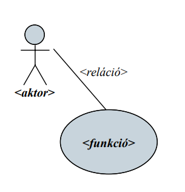

#### 4.1.2 Relációk

A relációk típusai:

- használat (usage): az aktor igénybe veszi a rendszer egy funkcióját (mindig csak aktor és funkció között)
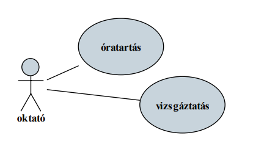

- általánosítás (generalization): egyik funkció, vagy aktor egy bővebb halmaz, mint a másik
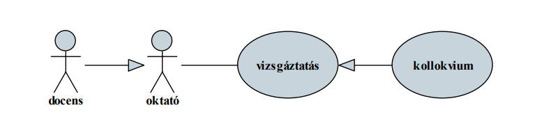

- tartalmazás (include): egyik funkció részét képezi egy másik funkciónak
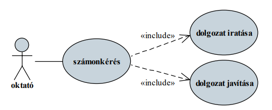

- kiterjesztés (extend): egyik funkció kiterjesztése egy másik funkcióval
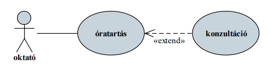

- előfeltétel (precedes): egy funkciónak meg kell előznie egy másik funkciót
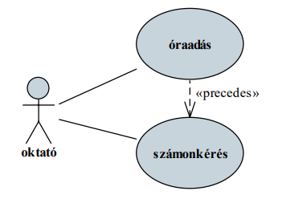

- rákövetkezés (invokes): egy funkciót követ egy másik
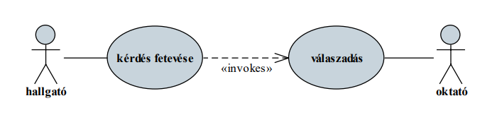

Összetett diagramok esetén a rendszer egyes elemeit, alrendszereit elhatárolhatjuk egymástól
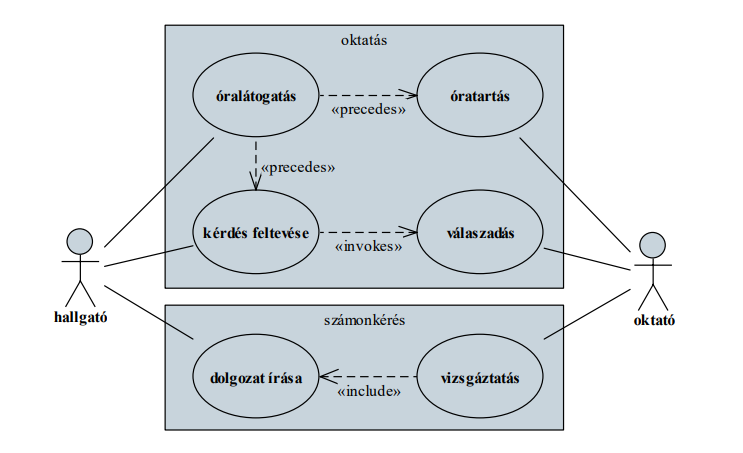

#### 4.1.3 Példa

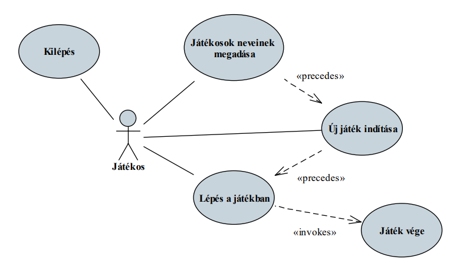

### 4.2 Felhasználói történetek

A funkciók részletesebb kifejtését teszik lehetővé a felhasználói történetek (user story)
- a felhasználók által végzett tevékenységsorozatokat és azok lehetséges kimeneteleit adják meg különböző szituációkban
- a történetben azonosítunk egy szerepkört (user role) és egy célt, valamint megindokoljuk a cél szükségesség

_Mint_ oktató, 
_szeretném_ megtartani az előadást 
_azért, hogy_ a hallgatók jobban megértsék az anyagot.

- az indoklás elhanyagolható, amennyiben egyértelmű
- a történetet rögzített kulcsszavakkal írjuk le
(As a … I want to … so that …)

Egy történetre egy, vagy több esetet írhatunk fel, amelyben adott környezetben (given) egy tevékenységet végzünk (when), és erre valamilyen hatást (then) várunk

_Amennyiben_ tart az előadás,
_ha_ az oktató elköszön a hallgatóságtól,
_akkor_ a hallgatóság elhagyja a termet.

- az eseteket úgy kell megfogalmaznunk, hogy az összes
körülményt és lehetséges bemenetet figyelembe vesszük
- különös tekintettel a hibalehetőségekre (pl. hibás bevitel)
- az egyes történetek egyúttal megadják a végleges alkalmazás
funkcionális teszteseteit

#### 4.2.1 Példa

_Mint_ játékos, 
_szeretnék_ lépni a játékban, 
_azért, hogy_ megnyerjem a játékot

1. 
_Amennyiben_ én következem,
_ha_ olyan oszlopot és sort választok, amely szabad a táblán,
_akkor_ a játék elfogadja a lépésemet.

2. 
_Amennyiben_ a játék elfogadta a lépésemet,
_ha_ az adott sorban, oszlopban, vagy átlósan kijön a 3 találat,
_akkor_ győztem a játékban.

2. 
_Amennyiben_ a játék elfogadta a lépésemet,
_ha_ az adott sorban, oszlopban, vagy átlósan nem jön ki a 3 találat,
_akkor_ a másik játékos következik.

## 5. Követelmény validáció

A követelmények validációja (requirements validation) ellenőrzi a megadott specifikáció valószerűségét, konzisztenciáját és teljességét.

Mivel a követelményeknek ellenőrizhetőnek kell lennie, alkalmasnak kell lennie tesztesetek előállítására

A validáció eredményezhet:
- prototípust, amelynek célja a követelmények teljesíthetőségének rövid távú ellenőrzése
- teszteseteket, amelyek a végleges alkalmazáson ellenőrzik a követelmények teljesülését
- elsősorban a funkcionális követelményekre
- a felhasználói történetek egy az egyben megfeleltethetőek funkcionális teszteseteknek

## 6. Követelmény leírás

A követelmény-leírás tartalmazza a szoftver
- célját, helyét, szükségességét, előzményeit, előnyeit
- a funkcionális és nem funkcionális követelmények leírását
- felhasználói szemszögből (felületes áttekintés, használati eset diagramok)
- fejlesztői szemszögből (részletes ismertetés, felhasználói történetek)
- a rendszer átfogó architektúráját (a rendszer felbontását alrendszerekre, azok kapcsolatait) és modelljeit
- áttekintést (javaslatokat, becsléseket) az implementáció és az evolúció számára
- a fogalomjegyzéket (technikai kifejezések leírását)

A követelmény-leírás felépítése:
1. előszó (célközönség, dokumentum-történet)
2. bevezetés (szoftver célja, helye, szükségessége, előnyei)
3. fogalomtár (technikai áttekintés)
4. követelmények felhasználói leírása
5. rendszer architektúra (magas szintű áttekintés)
6. követelmények fejlesztői leírása
7. rendszer modellek (pl. felület terv, adatformátum leírás)
8. rendszer evolúció (várható fejlesztések, karbantartás)
9. függelék (pl. adatbázis terv, becsült hardver szükségletek)
10. tárgymutató