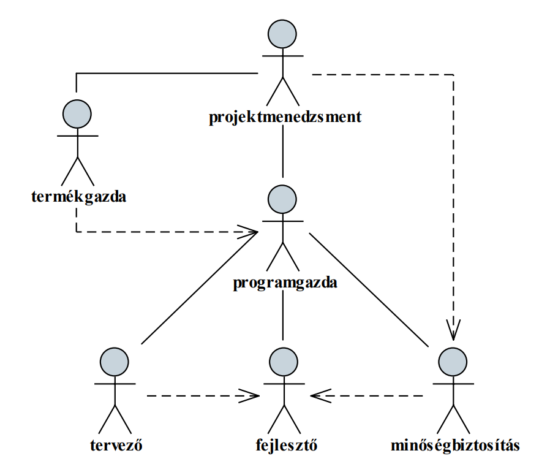
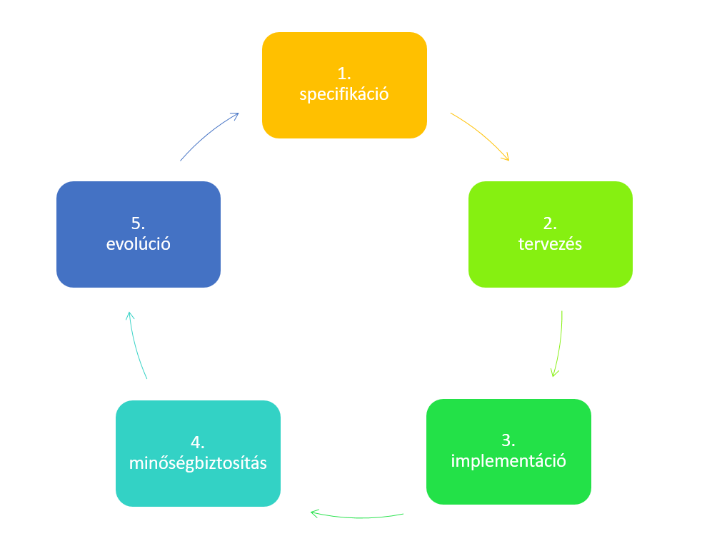
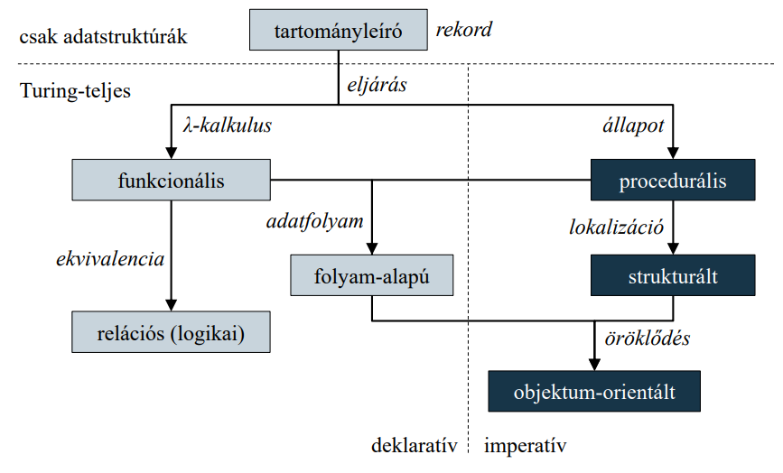
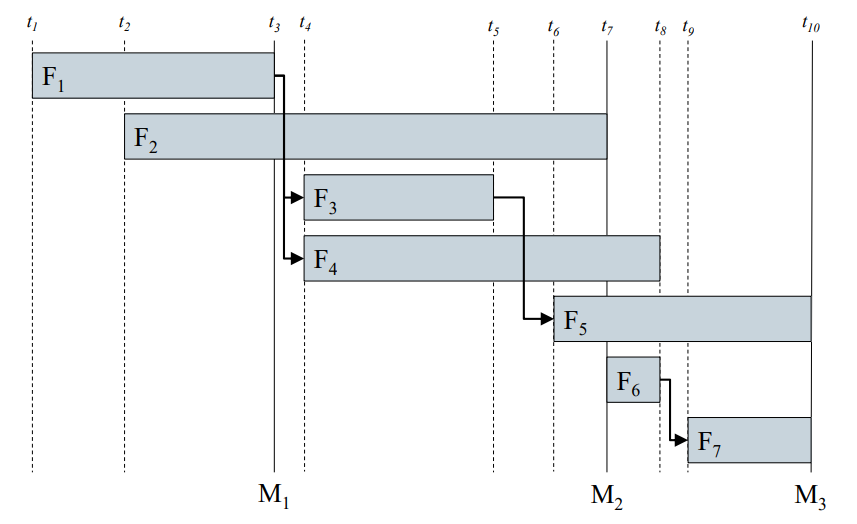
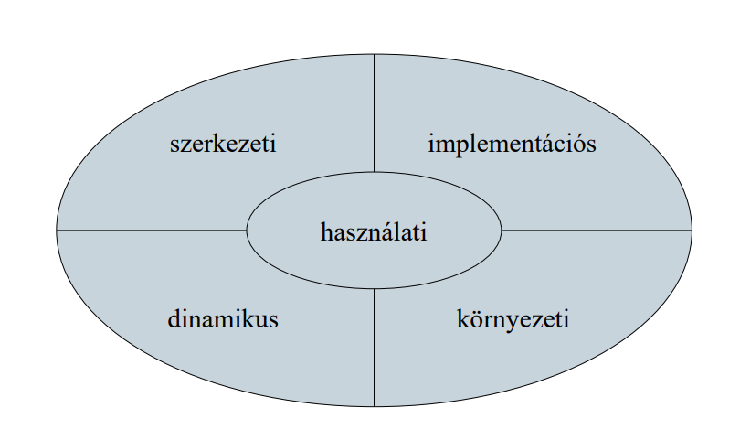

# A szoftverfejlesztési folyamat

## 1. Szoftverfejlesztés 

A szoftver a program(ok), dokumentáció(k), konfiguráció(k), valamint adatok együttese

A szoftverek nélkülözhetetlen alkotóelemei a modern világnak
- számos célt szolgálhatnak
- különböző felépítésűek, működési elvűek
- megvalósításuk módja jelentősen eltérhet

A szoftverekben sok hiba található, a szoftverfejlesztési munkák nagyrésze kudarcba fullad, ennek okai:
- egyre nagyobb számban, egyre összetettebb szoftverekre van szükség
- alacsonyak az elvárások a szoftverekkel szemben

Nagy szükség van a professzionális szoftverfejlesztésre

## 2. Minőségi mutatók

A szoftvereknek megfelelő színvonalon kell biztosítania az elvárt funkciókat, amit a szoftver minőségi mutatóival (quality characteristics) írhatunk le
- karbantarthatóság (maintainability): módosíthatóság,
továbbfejleszthetőség lehetőségei
- megbízhatóság és biztonság (dependability and security): meghibásodások valószínűsége, támadásokkal szembeni védelem, sebezhetőségi pontok
- hatékonyság (efficiency): erőforrások használata, korlátai, válaszidő, skálázhatóság
- használhatóság (acceptability): érthetőség, használat elsajátítása, ergonómia

## 3. Szoftvertechnológia

Egy szoftvernek, mint terméknek gyártási technológiára van szüksége, amely garantálja a program funkcióit, minőségét, költségét és határidejét

A szoftvertechnológia feladata szoftverek rendszerezett, felügyelt, minősített fejlesztése, működtetése és karbantartása

A szoftverek többsége nagy méretű, nagy bonyolultságú programrendszer, amely
- rendszerint csapatmunkában készül
- hosszú élettartamú, karbantartást és bővítést igényel

## 4. Szoftvertechnológiai projekt

A szoftver fejlesztésének folyamatát projektnek, előállításának felügyeletét projektmenedzselésnek nevezzük

A projektért felelős személy a projektmenedzser (project manager),
aki:
- biztosítja, hogy a szoftver megfelel az előírt minőségnek, és elkészül a megadott határidőre a költségkereten belül
- szervezi, irányítja, ütemezi a projektben részt vevő csapat munkáját, és biztosítja a szükséges hardver és szoftver erőforrásokat
- garantálja a módszerek és szabványok alkalmazását
- gondoskodik a projekt dokumentáltságáról

A szoftverfejlesztési csapatnak számos további tagja van általában, akik különböző szerepeket töltenek be, pl.:
- termékgazda (product management): üzleti folyamatok, prioritások és elfogadási feltételek kezelése
- programgazda (program management): fejlesztés ütemezése, feladatok elosztása és követése
- tervező (architect): szoftver magas szintű tervének elkészítése, technikai döntések kezelése
- fejlesztő (developer): szoftver implementációja
- minőségbiztosítás (quality assurance): tesztelés tervezése, magvalósítása, minőségi kritériumok ellenőrzése
- különböző szakértők, akik a projekten akár lehet, hogy csak minimálisan dolgoznak, egy-egy technológia kapcsán a szakértelmük, tanácsaik bevonására van szükség

## 5. A szoftver életciklusa

Minden szoftver rendelkezik életciklussal, amely meghatározza létét a feladat kitűzésétől a program használatának befejeztéig

Az életciklus általában az alábbi fő fázisokra bontható:
1. specifikáció (software specification): a szoftver funkcionalitásának és megszorításainak
megadása
2. tervezés (software design): a szoftver felbontása komponensekre, a közöttük lévő kapcsolatok leírása, környezetbe való beillesztésének részletei
3. implementáció (implementation): a specifikációnak megfelelő szoftver előállítása
4. minőségbiztosítás (quality assurance): a szoftver ellenőrzése a specifikációnak történő megfelelésre
5. evolúció (evolution): a szoftver utóélete, továbbfejlesztése a változó elvárásoknak megfelelően

További lépések is kísérhetik a fejlesztési folyamatot, pl.
- kihelyezés (deployment): a program üzembe állítása, és elérhetővé tétele
- tréning és támogatás (training and support): a felhasználókkal való kapcsolattartás (annak biztosítása, hogy a szoftvert megfelelően tudják kezelni és használni)

### 5.1. Specifikáció
Célja a feladatot megoldó szoftver funkcióinak tisztázása, a rendszerre és a fejlesztésre vonatkozó elvárások megadása

Feltérképezi a követelményeket felhasználói, valamint fejlesztői szemszögből, lépései:
- megvalósíthatósági elemzés
- követelmény feltárás és elemzés
- követelmény specifikáció
- követelmény validáció

Eredménye a szoftver követelmény-leírás (software requirements specification)

### 5.2. Tervezés

Feladata, hogy az implementációt előkészítse, a megvalósítás megkezdése előtt a rendszer szerkezetének, kommunikációs csatornáinak feltárása
- meghatározza a rendszer szerkezetét (felépülés), felületét (be- és kimenet), működését (alkalmazott algoritmusok, kommunikációs folyamatok)
- a folyamat során elkészül a szoftver rendszerterve (software design description), amely tartalmazza a program statikus és dinamikus szerkezetét, a kommunikációs csatornák feltérképezését, az implementációs és tesztelési tervet
- elkészíthető a szoftver prototípusa (prototype), amely a program egyszerűsített megvalósítását tartalmazza

### 5.3. Implementáció
Feladata a specifikáció átalakítása egy végrehajtható rendszerré a tervek mentén

- az implementációhoz megfelelő szoftverfejlesztési környezetet kell használnunk, a programkód változásait verziókövetéssel tartjuk nyilván
- az implementáció részeként az egyes programegységek tesztelése is megtörténhet
- a szoftverek tervezésének és programozásának módszerét nevezzük programozási paradigmának
  - meghatározza a programozási stílust, az absztrakciós szintet 
  - meghatározza az alkalmazható programozási nyelvek körét is, és fordítva
  
#### 5.3.1. Programozási paradigmák

### 5.4. Minőségbiztosítás

A szoftver verifikációja és validációja, vagy minőségbiztosítása (quality control) azon folyamatok összessége, amelyek során ellenőrizzük, hogy a szoftver teljesíti-e az elvárt követelményeket, és megfelel a felhasználói elvárásoknak 
- a verifikáció (verification) ellenőrzi, hogy a szoftvert a megadott funkcionális és nem funkcionális követelményeknek megfelelően valósították meg és történhet formális, vagy szintaktikus módszerekkel 
- a validáció (validation) ellenőrzi, hogy a szoftver megfelel-e a felhasználók elvárásainak, azaz jól specifikáltuk-e eredetileg a követelményeket, amelynek alapvető módszere a tesztelés

### 5.5. Evolúció

Az evolúció (software evolution) során új követelményeknek megfelelően bővítjük a szoftvert, illetve korrigáljuk a felmerülő hibákat
- átlagosan a szoftver élettartamának 80%-a, ezért eleve bővíthetőre, módosíthatóra kell kialakítani a szoftvert

A folyamat végre elkészülnek a következő dokumentumok is:
- felhasználói dokumentáció, amely tartalmazza a szoftver üzembe helyezésének, funkcióinak bemutatását
- fejlesztői dokumentáció, amely tartalmazza a szoftver megvalósítását folyamatát és részletes ismertetését

## 6. Projektirányítás

### 6.1. Ütemterv
A szoftver életciklus fázisai (feladatai) további fázisokra (részfeladatokra) tagolhatóak, így egy hierarchikus feladatszerkezetet kapunk
- az egyes feladatokra erőforrásokat és időkorlátot adhatunk
- az egyes feladatok között függőségeket állapíthatunk meg (a feladat nem kezdhető el, amíg a függősége el nem készül)
- ezek alapján elkészíthetjük a projekt ütemtervét
- tartalmazza a feladatok időbeli beosztását, függőségeit, felelőseit, így áttekinthetővé teheti az erőforrás szükségleteket
- általában a specifikáció során készül el, de később módosulhat

### 6.2. Mérföldkövek

A feladatokhoz mérföldköveket (milestone) rendelhetünk, amelyek lehetőséget adnak a projekt haladásában történő betekintésre
- a mérföldkő egy adott cél adott időpontra történő elérését jelenti, így névvel, eseménnyel, céllal rendelkezik
- a mérföldkövek be nem tartása általában korrekciókat követel a projekt lefutásában
- kellően konkrétnak, ellenőrizhetőnek, számon kérhetőnek kell lennie (akár a termékgazda számára is)
- a fő mérföldkövek az egyes fázisok lezárását jelentik, ezen kívül számos további mérföldkő adható

### 6.3. UML

A szoftverfejlesztési életciklust folyamatosan követi a modellezés, ennek eszköze az egységes modellezési nyelv (Unified Modeling Language, UML), amely egy öt pillérű szemléletrendszerrel
rendelkezik:
- használati: a szoftver szolgáltatásai és azok kapcsolata a felhasználókkal
- szerkezeti (statikus): a rendszer és a programegységek felépítése, kapcsolatai
- dinamikus: a programegységek viselkedése
- implementációs: a megvalósítás szempontjai, komponensei
- környezeti: hardver és szoftver erőforrások

### 6.4. Szoftverfejlesztési módszertanok

Amellett, hogy a szoftverfejlesztés betartja az életciklus fázisait, a folyamat lefolyása különféle módokon történhet, amiket szoftverfejlesztési módszereknek nevezünk
- klasszikus módszerek: vízesés, prototipizálás, inkrementális, iteratív, spirális, V-Model
- agilis módszerek: Scrum, Lean, Kanban, XP (extreme programming), RAD (rapid application development)
- speciális célú módszerek: BDD (behavior-driven development), TDD (test-driven development), FDD (feature-driven development)
- formális módszerek: B-módszer

A szoftverfejlesztési modell határozza meg az életciklus egyes fázisai közötti kapcsolatot, időbeliséget
  
### 6.5. Folytonos integráció
A folytonos integráció (continuous integration, CI) egy olyan gyakorlati módszer, amely lehetővé teszi a programkódok ellenőrzésének és tesztelésének felgyorsítását
- célja a lehetséges hibák, integrációs problémák azonnali, automatizált kiszűrése, visszajelzés a fejlesztőnek
- a programkódok verziókezelő rendszer segítségével egy központi tárhelyre kerülnek, naponta többször
- a tárhely tartalma minden módosítást követően automatikusan fordításra kerül (build automation), a fordítással pedig a lekódolt tesztek is végrehajtódnak
- az így ellenőrzött kódot további tesztelés követheti

### 6.6. Szoftvereszközök

A fejlesztőcsapat munkáját megfelelő szoftvereszközökkel kell alátámasztani
- projektirányítási eszközzel (project tracking system), amely támogatja a dokumentálást és a feladatok követését
- fejlett tervezőeszközzel (case tool), ahol a fejlesztés folyamata és a felelősség is nyomon követhető
- integrált fejlesztőkörnyezettel (IDE), amely elősegíti a csapatmunkát, pl.: Eclipse, IntelliJ IDEA, NetBeans, Visual Studio, stb
- verziókövető rendszerrel (version control system - VCS), amely lehetővé teszi a programkód változásainak követését, pl.: SVN, Git
- folyamatos integrációs eszközzel (continuous integration), amely elősegíti a tevékenységek automatizálását, pl.: Jenkins, Hudson

### 6.5.1. Projektirányítási eszközök

A projektirányítási eszköz lehetőséget ad a projekt menedzselésének ellátására

Általában webes felületű eszköz, amely bárhonnan elérhető és használható

Főbb funkciói:
  - fejlesztés ütemtervének, kockázatainak rögzítése
  - egyszerű és folyamatos dokumentálás lehetősége
  - feladatok, tevékenységek, hibák rögzítése, és a kapcsolatos tevékenységek követése
  - integrált forráskód böngészés, és forrástörténet áttekintés (verziókezelés)
  
Például: Atlassion Jira, Redmine, stb.

A rendszerek lehetőséget adnak a fejlesztők számára feladatok kitűzésére, valamint a tesztelők számára a programban fellelhető hibák jelzésére 
- a feladatokat úgynevezett cédulák (ticket, issue) segítségével írhatóak ki
- jelölhetnek új funkcionalitást (feature), hibát (bug), egyéb fejlesztési feladatot (task), vagy dokumentációs feladatot (documentation)
- megadható a leírása, felelőse, határideje
- kommentálhatóak, lezárhatóak, újra kinyithatóak
- a cédulák biztosítják a fejlesztési és tesztelési folyamat naplózását

### 6.6.2. Projektvezető szolgáltatások

A projektvezető szolgáltatások (project hosting services) olyan online szolgáltatások, amelyek a projekttel kapcsolatos legtöbb funkcionalitást integrálják
- projektmenedzsment, kód tárolás, verziókövetés, dokumentáció, folyamatos integráció, kihelyezés
- integrálhatóak projektirányítási eszközökkel, fejlesztőeszközzel
- garantálják a kód épségét, a folyamatos rendelkezésre állást
- általában nyílt forráskódú szoftverek esetén ingyenes a használatuk
- pl.: GitHub, GitLab, SourceForge

## 7. 3 Biggest Software Lies:
- The program’s fully tested and bug-free.
- We’re working on the documentation.
- Of course we can modify it
