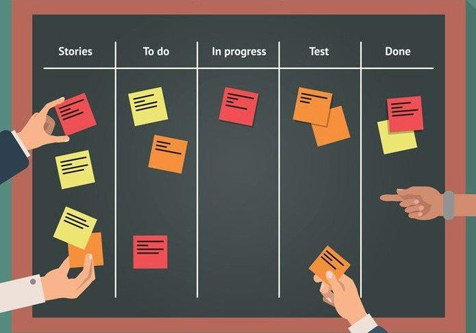

Szoftverfejlesztési módszertanok

Amellett, hogy a szoftverfejlesztés betartja az életciklus fázisait, a folyamat lefolyása különféle módokon történhet, amiket szoftverfejlesztési módszereknek nevezünk
- klasszikus módszerek: vízesés, prototipizálás, inkrementális, iteratív, spirális, V-Model
- agilis módszerek: Scrum, Lean, Kanban, XP (extreme programming), RAD (rapid application development)
- speciális célú módszerek: BDD (behavior-driven development), TDD (test-driven development), FDD (feature-driven development)
- formális módszerek: B-módszer

A szoftverfejlesztési modell határozza meg az életciklus egyes fázisai közötti kapcsolatot, időbeliséget

#### 6.4.1. Vízesés modell

A legegyszerűbb fejlesztési modell a vízesés (waterfall) modell, amelyben az egyes fázisok lineárisan követik egymást
- előre megtervezi a projekt időtartamát, ráfordításait
- elvárja minden fázis megfelelő dokumentálását, amely tartalmazza annak eredményeit
- előnyei: jól strukturált, dokumentált folyamatot biztosít
- hátrányai: nem teszi lehetővé a követelmények megváltoztatását, nem készül fel az esetleges nehézségekre (nincs kockázatkezelés)

#### 6.4.2. Agilis szoftverfejlesztés

Az agilis szoftverfejlesztés (agile software development) célja a gyors alkalmazásfejlesztés megvalósítása, inkrementális alapon
- a szoftver folyamatos fejlesztés és kiadás alatt áll (continuous delivery), a sebesség állandó, a változtatások minden lépésben beépíthetőek (welcome changes)
- a működő szoftver az előrehaladás mérőeszköze, előtérben az egyszerűség, ugyanakkor folyamatos odafigyelés a megfelelő tervezésre, optimalizációra
- a fejlesztést általában önszervező, kis csapatok végzik, megosztott felelősséggel, folytonos interakcióval, gyors visszajelzésekkel

Az [Agilis Kiáltvány](https://agilemanifesto.org/) a következőket mondja ki:

Azzal leplezzük le a szoftverfejlesztés jobb módjait, hogy csináljuk és segítünk másoknak is csinálni. Ezen a munkán keresztül következő értékekhez jutottunk el:
- Egyének és kölcsönhatások előnyben részesítése a folyamatok- és eszközökkel szemben
- Működő szoftver előnyben részesítése az átfogó dokumentációval szemben
- Ügyféllel való együttműködés előnyben részesítése a szerződéses megállapodással szemben
- Változásokra adandó válasz előnyben részesítése egy terv követésével szemben
Habár a jobb oldali elemekben is van érték, mi sokkal értékesebbnek tartjuk a baloldali elemeket. (© 2001, Beck, K., et. al.)

Az agilis fejlesztés
- előnyei: jól alkalmazkodik a változtatásokhoz, hatékonyabbá teszi a fejlesztési folyamatot
- hátrányai: egyes tényezői nehezen megvalósíthatóak, különösen nagyobb szoftverek esetén a megvalósításhoz képzett fejlesztők kellenek, a dokumentáció hiánya megnehezíti a későbbi evolúciót
Az agilis fejlesztés elveit több speciálisabb módszertan ültette át a gyakorlatba
- pl. Extreme programming, Scrum, Kanban, Lean
- a módszertanok nem szeparáltak, a gyakorlatban sokszor vegyítve alkalmazzák őket

##### 6.4.2.1. Extreme programming
Az Extreme programming (XP) a gyors fejlesztési ciklusokra támaszkodik
-  elvárja a követelmények viselkedés alapú felbontásával (BDD), a tesztek előre történő megadását (TDD), a folyamatos integrációt és refaktorálást
- támogatja a párban történő programozást

##### 6.4.2.2. Scrum
Az agilis fejlesztés menedzselését az egyes változatok előállítása szempontjából közelítik meg, amelyhez a Scrum módszer ad egy általános modellt, amelynek fő lépései:
1. architekturális tervezés, amely megadja a szoftver magas szintű vázát
2. futamok (sprint), amelyek az egyes változatokat állítják elő, és rögzített hosszúságúak (2-4 hét)
3. projektzárás, a szükséges dokumentáció előállítása
Nincs projektmenedzser, de minden futamnak van felelőse (scrum
master), akinek a személye futamonként változik

Minden futam egy összetett folyamat megtervezett lépésekkel
- feladatok felmérése (select), lefejlesztése (develop), áttekintése (review), kiértékelése (assess)
- a megvalósítandó funkciók a termékgazdával egyetértésben kerülnek kiválasztásra a teendők listájából (product backlog)
- naponta rövidebb megbeszélések (stand-up meeting) a teljes csapat számára
- ciklus elején/végén hosszabb megbeszélések (sprint planning, sprint review), valamint visszatekintés (retrospective) a termékgazdával

##### 6.4.2.3. Kanban
A Kanban módszer célja a döntéshozatal elősegítése, és a fejlesztési folyamat gyors áttekintése
- eszköze a Kanban tábla (Kanban board), amely vizualizálja a fejlesztési feladatok állását
- elvei:
  - kiinduló állapot áttekintése, folyamatos, kísérleti továbbfejlesztés
  - fókuszban a felhasználói elvárások, folyam*atos visszajelzés
  - egyéni döntéshozatal, önszervezés támogatása, tanulás és fejlődés
  - munkamennyiség és kiegészítő tevékenységek korlátozása

