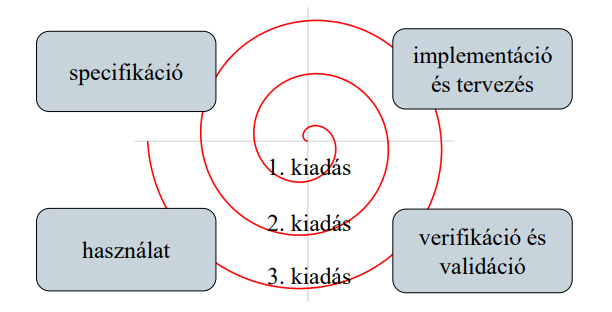

# Evolúció

## 1. Változások kezelése

A program használata során számos változás következhet be, amely
hatására tovább kell fejlesztenünk a szoftver, ez az evolúció
(software evolution)
- átlagosan a szoftver élettartamának 80%-a
- elsősorban külső követelmények befolyásolják

A változás hatására a program egyes részeit újra kell tervezni, illetve
megvalósítani, a változásra a projekt felkészülhet
- a követelmények előrevetítésével (change avoidance), pl.
prototípus létrehozásával
- a módosítási lehetőségek nyitottan hagyásával (change
tolerance), pl. inkrementális fejlesztéssel

## 2. Az evolúciós életciklus

A szoftver evolúció lépésekben történik, amelyek a szoftver újabb
kiadását (release) eredményezik
- minden lépésben végig kell vinnünk a szoftvertechnológiai
folyamatot, ami egy spirált ad

A lépések 3 kategóriába sorolhatóak:
- bővítés (perfective maintenance): új funkciók bevezetése
- adaptálás (adaptive maintenance): a szoftver új
(hardver/szoftver) környezetbe történő bevezetése
- hibajavítás (corrective maintenance): a kiadás után felmerült
hibák javítása

Az evolúció idejét, költségeit több tényező is befolyásolja:
- a fejlesztőcsapat stabilitása
- a dokumentáció és a programkód minősége
- a program kora és struktúrája

## 3. Programverziók

A szoftver az evolúció során több kiadott változattal (release)
rendelkezik, amelyeket verziószámmal látunk el
- a javításokat, funkció bővítéseket általában kisebb (minor)
verziók jelölik
- a jelentős módosításokat új programváltozatok (major) keretében
kerülnek publikálásra
- a kisebb verziók között hangsúlyos a kompatibilitás megőrzése

A verziószám további információk egészíthetik ki, pl.
major.minor[.maintenance[.build]], vagy
major.minor[.build[.revision]] formában

## 4. Lehman törvények

A szoftver változási folyamatokra érvényes általános elveket a
Lehman törvények fogalmazzák meg
- egy szoftvernek változnia kell, vagy folyamatosan csökken a
használhatósága és minősége
- a változó szoftver egyre összetettebb lesz és egyre több
funkcióval rendelkezik
- az evolúciós folyamat önszabályozó, a rendszer tulajdonságai
(méret, hibák száma, …) függetlenek a kiadástól
- az evolúciós folyamatban szükséges a visszajelzések, amelyeket
figyelembe kell venni

## 5. Legacy rendszerek

A legacy rendszerek olyan régi szoftverrendszerek, amely még
mindig hasznosak és nélkülözhetetlenek
- nem cserélhetőek újabb rendszerre, vagy cseréjük túl költséges
lenne
- általában elavult nyelven készültek elavult technológiákkal,
dokumentációjuk nincs, vagy hiányos

A legacy rendszerek esetén sokszor úja meg kell valósítani a
szoftvert (reengeneering), ami magában foglalhatja
- a program és az adatok elemzését (reverse engineering)
- a forráskód átvitelét új programnyelvre, a programstruktúra és az
adatreprezentáció megváltoztatását
