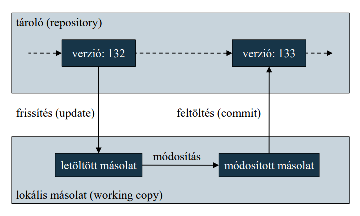
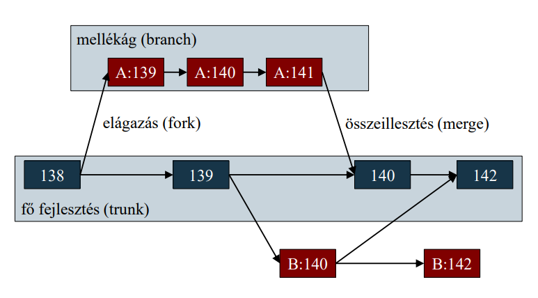

# Implementáció és verziókövetés

## Implementáció

Az implementáció a programkód elkészítése a rendszertervnek
megfelelően adott programozási nyelven
- az adatok megfelelő ábrázolása, reprezentálása
- a funkciókat megvalósító algoritmusok alkalmazása
- korábban már bevált elemek (algoritmusok, programszerkezetek)
újhasznosítása
- a minőségi mutatóknak megfelelő optimalizálások
(teljesítményjavítások) végrehajtása

Az implementációt verifikáció zárja, amelyben ellenőrizzük, hogy a
szoftver teljesíti-e a tervben megszabott funkciókat

## Újrahasznosítás

Az implementáció általában nagyban támaszkodik újrahasznosításra
- garantálja, hogy jó, hibamentes megoldások kerüljenek
alkalmazásra
- csökkenti az implementáció (és a tesztelés) idejét és költségeit
- az újrahasznosítás elvégezhető objektum, csomag, vagy
komponens szinten

A fejlesztő nem csupán az általa korábban fejlesztett elemeket
használhatja újra, de más fejlesztő által megvalósított elemeket
- pl. nyílt forráskódú programcsomagok
- általában előre fordított formában állnak rendelkezésre

## Integrált fejlesztőkörnyezet

Az implementációhoz megfelelő integrált fejlesztőkörnyezet (IDE)
szükséges (pl. Eclipse, Visual Studio, Xcode, NetBeans)
- a teljes szoftver életciklust támogatja, integrálja a verziókövetést
és a tesztelést
- a fejlesztést kód-kiemeléssel (syntax highlight), kódkiegészítésekkel (code-snippet, intelligent code completion),
illetve kód-újratervezési eszközökkel támogatja
- megkönnyíti külső programcsomagok integrációját (package
manager)
- a tesztelést nyomkövetéssel (debugging), egységtesztek (unit
test), illetve teljesítményteszteléssel támogatja 

## Csapatban történő implementáció

A szoftverek általában csapatban készülnek
- az implementáció egy egységes kódolási stílus mentén történik,
egységes eszköztárral
- minden fejlesztő csak a saját programkódján dolgozik
    - a verziókövető rendszerben általában külön fejlesztési ágban
tevékenykedik
    - amennyiben más kódjában hibát talál, hibajelzést tesz
    - az általa biztosított interfészeket csak egyeztetés után
módosítja
    - dokumentálja (kommentezi), illetve teszteli a saját kódját
(elkészíti a megfelelő egységteszteket)

## Kódálási stílus

A kódolási stílus (coding style) egy szabályhalmaz, amely a
forráskód megjelenésére (pl. elnevezés, indentálás, szóközök
elhelyezése, …) ad iránymutatást
- a kódolási stílus követése javítja a kód értelmezhetőségét, a
későbbi karbantartást, és lehetővé teszi a fejlesztők közötti
kommunikáció zökkenőmentességét
- a jó programozási stílus általában szubjektív, nem túl szigorú, de
alapvető elemeket definiál
- a kódolási stílus lehet nyelvi szinten, vállalati szinten, vagy
szoftverszinten rögzített
- a fejlesztőkörnyezetek általában lehetőséget adnak a forrás
automatikus formázására

Általános érvényű javaslatok:
- kódrészletek megfelelő elválasztása (szóköz, sortörés, behúzás,
függőleges igazítás)
- beszédes és konzisztens elnevezések használata (kevesebb
kommentezést igényelnek)
- beégetett tartalmi elemek (számok, szövegek) megnehezítik a
karbantartást (hard coding), ezért célszerű a kerülése, kiemelése
fejlécbe, vagy konfigurációs fájlba (soft coding)

A kódolási konvenció rákényszeríthető a programozóra kódolási
stílus ellenőrző eszköz segítségével
- pl. C++Test, StyleCop

### Kommentezés

A kódot a stílusnak megfelelő kommenttel kell ellátni
- alapvető fontosságú az interfész kommentezése (osztályok,
függvények, paraméterek)
- a megvalósítás kommentezése összetett funkcionalitás esetén
hasznos, de megfelelő kódolási stílus esetén nem szükséges
- tartalmazhat speciális jelöléseket (pl. TODO, FIXME)
- a túl kevés, vagy túl sok komment is ártalmas lehet

A kommentek felhasználhatóak dokumentáció előállítására is (pl.
Doxygen, Javadoc), amennyiben azokat megfelelő séma szerint
hozzuk létre

Általában nyílt és zárt programkódokra más szabályok vonatkoznak
- nyílt forráskód esetén törekedni kell, hogy a kód minél
gyorsabban értelmezhető legyen bárki számára
    - követni kell a programozási nyelv tördelési és elnevezési
konvencióit
    - a kód megfelelő mennyiségű megjegyzéssel kell ellátni
- zárt forráskód esetén a cél a fejlesztőcsapat minél nagyobb
rálátása a kódra
    - törekedni kell, hogy minél nagyobb kódmennyiség legyen
egyszerre áttekinthető (kevesebb helyköz és komment)

## Statikus kódelemzés

A statikus kódelemzés (static code analysis) lehetővé teszi, hogy a
forráskódot még a fordítás előtt előfeldolgozzuk, és a lehetséges
hibákat és problémákat előre feltérképezzük
- a fejlesztőkörnyezet beépített kódelemzővel rendelkezhet, amely
megadott szabályhalmaz alapján a lehetséges hibaeseteket felfedi
- a statikus kódelemzés egy része kimondottan a kódolási
konvenciók (pl. elnevezések, tagolás, dokumentáltság)
ellenőrzését biztosítja
- a kódra számíthatók metrikák (code metric), amelyek megadják
karbantarthatóságának, összetettségének mértékét (pl. cyclomatic
complexity, class coupling)

## Kód-újratervezés

A kód-újratervező (refactoring) eszközök célja, hogy a kód
szerkezetét mindig konzisztens módon, a viselkedés befolyásolása
nélkül tudjuk módosítani
- a teljes újratervezést kisebb lépések (micro-refactorings)
sorozatával érjük el
- pl. átnevezések, ismétlődő kódok kiemelése, típuscsere, interfész,
vagy ősosztály kiemelése, tervezési minta bevezetése
- a kód nem funkcionális követelményeinek javítására szolgál,
általában a karbantarthatóság, illetve a bővíthetőség növelése a
cél
- alkalmas bizonyos rejtett hibák, vagy sebezhetőségek felfedésére

## Verziókövetési rendszerek

A verziókövető rendszerek (revision control system) célja a forráskód
változásának követése, és a korábbi állapotok megőrzése
- ezáltal könnyen áttekinthető, ki milyen módosításokat hajtott
végre a forráson, amelyek szükségszerűen visszavonhatóak
- egy közös tárolóban (repository) tartják kódokat, amit a
fejlesztők lemásolnak egy helyi munkakönyvtárba (working
copy), és ebben dolgoznak
- a módosításokat visszatöltik a központi tárolóba (commit)
- a munkakönyvtárakat az első létrehozás (checkout) után
folyamatosan frissíteni kell (update)
- pl. Subversion (SVN), Git, Team Foundation Server (TFS)

A rendszerek biztosítják:
- az összes eddig változat (revision) eltárolását és lekérdezését,
benne a legfrissebb változattal (head)
- az egyes változatok közötti különbségek nyilvántartását (akár
karakterek szintjén)
- változtatások visszavonását, korábbi változatra visszatérést
- a fő fejlesztési vonal (baseline, master, vagy trunk) mellett
további fejlesztési vonal elágazását (fork), párhuzamos követését,
valamint az ágak összeillesztését (merge)
- a módosítások közötti konfliktusok kezelését (resolve)

### Elosztott verziókövető rendszerek
A központosított verziókelezők mellett elterjedtek az elosztott
(distributed) rendszerek
- nagyobb szabadságot adnak a tárolók kezelésében, a
szinkronizálási lehetőségekben
- egy főtároló (origin) csak egy kiindulási pont, tetszőleges
másolatot készíthetünk (clone) belőle
- a módosítások csak a lokális másolatot befolyásolják, külön kell
feltöltenünk azokat valamely távoli tárolóra (push), vagy
jelölhetjük őket feltöltésre (pull request)
- az egyes tárolók állapotait szinkronizálhatjuk (pull, fetch)
- pl. Git, Bazaar, Mercurial

