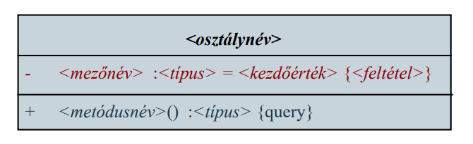

# Objektumorientált tervezés: alapismeretek

## 1. Procedurális programozás

A procedurális programozási paradigma összetett alkalmazások esetén számos korlátozást tartalmaz:
- a program nem tagolható kellő mértékben (csupán alprogramok adottak)
- az adatok élettartama nem eléggé testre szabható (vannak lokális és globális változók)
- a vezérlés egy helyre (főprogram) összpontosul
- a feladat módosítása utóhatásokkal rendelkezhet

Pl. amennyiben módosítjuk egy alprogramban az adatok reprezentációjának módját, az hatással lehet az összes, vele kapcsolatban álló alprogramra

## 2. Objektumorientált programozás kialakulása

Megoldások:
- a felelősség továbbadása
    - programegységeket alakítunk ki, amely rendelkeznek saját adataikkal és műveleteikkel, ezeket egységbe zárjuk, megvalósításukat elrejtjük
    - a feladat megoldását a programegységek együttműködésével, kommunikációjával valósítjuk meg
- a reprezentáció és a belső működés elrejtése
    - a külvilág (többi programegység) elől elrejtjük a működést, beleértve az adatok kezelésének módját
    - a belső módosítások így nem befolyásolják a kommunikációt
	
## 3. Objektum

Objektumnak (object) nevezzük a feladat egy adott tárgyköréért felelős programegységet, amely tartalmazza a tárgykör megvalósításához szükséges adatokat, valamint műveleteket

Az objektum működése során saját adatait manipulálja, műveleteit futtatja és kommunikál a többi objektummal

Pl.: egy téglalap
- adatai: szélessége és magassága
- műveletei: területkiszámítás, méretváltoztatás
	
Az objektumok életciklussal rendelkeznek: létrejönnek (a konstruktorral), működést hajtanak végre (további műveletekkel), majd megsemmisülnek (a destruktorral)

Az objektumok állapottal (state) rendelkeznek, ahol az állapot adatértékeinek összessége
- két objektum állapota ugyanaz, ha értékeik megegyeznek (ettől függetlenül az objektumok különbözőek)
- az állapot valamilyen esemény (műveletvégzés, kommunikáció) hatására változhat meg

A program teljes állapotát a benne lévő objektumok összesített állapota adja meg

## 4. Az objektum-orientált program

Objektum-orientáltnak nevezzük azt a programot, amelyet egymással kommunikáló objektumok összessége alkot
- minden adat egy objektumhoz tartozik, és minden algoritmus egy objektumhoz rendelt tevékenység, nincsenek globális adatok, vagy globális algoritmusok
- a program így kellő tagoltságot kap az objektumok mentén
- az adatok élettartama összekapcsolható az objektum élettartamával
- a módosítások általában az objektum belsejében véghezvihetők, ami nem befolyásolja a többi objektumot, így nem szükséges jelentősen átalakítani a programot

Az objektum-orientáltság öt alaptényezője:
- absztrakció: az objektum reprezentációs szintjének megválasztása
- enkapszuláció: az adatok és alprogramok egységbe zárása, a belső megvalósítás elrejtése
- nyílt rekurzió: az objektum mindig látja saját magát, eléri műveleteit és adatait
- öröklődés: az objektum tulajdonságainak átruházása más objektumokra
- polimorfizmus és dinamikus kötés: a műveletek futási időben történő működéshez kötése, a viselkedés átdefiniálása

## 5. Az osztály

Az objektumok viselkedési mintáját az osztály tartalmazza, az osztályból példányosíthatjuk az objektumokat
- tehát az osztály az objektum típusa
- speciális osztályoknak tekinthetőek a
    - rekordok (record, structure), amelyek általában metódusok nélküli, egyszerűsített osztályok, adattárolási céllal
    - felsorolási típusok (enumeration), amelyek csak értékkel rendelkeznek

Az osztályban tárolt adatokat attribútumoknak, vagy mezőknek (field), az általa elvégezhető műveleteket metódusoknak (method) nevezzük, ezek alkotják az osztály tagjait (member)

## 6. Láthatóság

Az osztály tagjainak szabályozhatjuk a láthatóságát, a kívülről látható (public) részét felületnek, vagy interfésznek, a kívülről rejtett (private) részét implementációnak nevezzük
- a metódusok megvalósítása az implementáció része, tehát más osztályok számára a működés mindig ismeretlen
- az osztály mezői is az implementáció része, ezért minden mező rejtett (kivéve rekordok esetén)
- a mezőkhöz hozzáférést lekérdező (getter), illetve beállító (setter) műveletekkel engedélyezhetünk

Az osztályokat minden nyelv más formában valósítja meg, de az általános jellemzőket megtartja

## 7. Osztálydiagram

Az UML osztálydiagram (class diagram) a programban szereplő osztályok szerkezetét, illetve kapcsolatait definiálja
- az osztálynak megadjuk a nevét, valamint mezőinek és metódusainak halmazát (típusokkal, paraméterekkel)
- megadjuk a tagok láthatóságát látható (+), illetve rejtett (-) jelölésekkel

Az osztálydiagram egyszerűsíthető:
- elhagyhatjuk attribútumait, metódusait, vagy minden tagját
- tagjainak szintaxisát is egyszerűsíthetjük (pl. paraméterek, visszatérési típus elhagyása)

Felsorolási típusoknál csak a felvehető értékeket adjuk meg (láthatóság nélkül)

Feladat: Valósítsuk meg a téglalap (Rectangle) osztályt, amely utólag átméretezhető, és le lehet kérdezni a területét és kerületét.
- a téglalapnak a feladat alapján elég a méreteit letárolni (height, width), amelyek egész számok lesznek
- ezeket a későbbiekben lekérdezhetjük (getWidth(), getHeight()), vagy felülírhatjuk (setWidth(int), setHeight(int))
- lehetőséget adunk a terület, illetve került lekérdezésére (area(), perimeter())
- lehetőséget adunk a téglalap létrehozására a méretek alapján (Rectangle(int, int))

### 7.1. Osztálydiagram kiegészítései

Az osztálydiagram számos kiegészítést tartalmazhat
- feltételeket (invariánst) szabhatunk a mezőkre, metódusokra a {…} jelzéssel
    - speciálisan a lekérdező műveleteket a {query} jelzéssel jelölhetjük
- jelölhetünk kezdőértéket a mezőkre (amelyet a konstruktor állít be)

- adhatunk sablont a típusnak
- további tulajdonságokat jelölhetjük, illetve csoportba foglalásokat végezhetünk a <<…>> jelzéssel 

Feladat: Valósítsuk meg a téglalap (Rectangle) osztályt, amely utólag átméretezhető, és le lehet kérdezni a területét és kerületét.
- a téglalap méretei nem lehetnek negatívak, ezt mind a mezőknél, mint a paramétereknél megadhatjuk feltételként (a paraméternek jelöljük a nevét)
    - az implementációban is biztosítanunk kell a feltételek ellenőrzését
- a terület és kerület műveletek csak lekérdező műveletek, ezt jelölhetjük a tervben és a megvalósításban (const)
- a lekérdező, illetve beállító műveleteket külön csoportokba sorolhatjuk

### 7.2. Kapcsolatok

A programot általában több osztály alkotja, az osztályok, illetve objektumok között pedig kapcsolatokat építhetünk fel, úgymint
- függőség: szemantikai kapcsolat
- asszociáció (társítás): szerkezeti kapcsolat (csak objektumok között)
    - aggregáció (hivatkozás): laza összekapcsolás
    - kompozíció (tartalmazás): szoros összekapcsolás
- általánosítás (generalizáció): általános és speciális kapcsolata (csak osztályok között)
    - megvalósítás: szemantikai kapcsolat a fogalom és megvalósítója között (csak interfész és osztály között)

#### 7.2.1. Függőség

A függőség (dependency) a legáltalánosabb kapcsolat, amelyben egy objektum (osztály) igénybe vehet funkcionalitást egy másik objektumtól (osztálytól)

- a függőség kialakítható metódushívással, példányosítással, hivatkozással (pl. visszatérési értékként, paraméterként)
- a függő osztály felületének megváltoztatása hatással van a másik osztály működésére

#### 7.2.2. Asszociáció

Az asszociáció (association) egy kommunikációs kapcsolat, ahol egy objektum üzenetet küldhet egy (vagy több) további objektumnak

- a kommunikáció lehet irányított, irányítatlan (kétirányú), reflexív (saját osztály másik objektumára)

- az asszociációnak lévő osztályoknak lehet
   - szerepe, ami a relációbeli minőségükre utal, ezt az adott végponton jelöljük (ez is megjelölhető láthatósággal)
   - multiplicitása, ami a relációbeli számosságukra utal (lehet rögzített, tetszőleges érték, vagy intervallum)

- a relációnak lehetnek további tulajdonságai, amelyeket függőségként csatolhatunk

#### 7.2.3. Aggregáció

Az aggregáció (aggregation) egy speciális asszociáció, amely az objektumok laza egymáshoz rendelését fejezi ki

- egy tartalmazási, rész/egész kapcsolatot jelent, állandó kapcsolat a két objektum között
- a részt vevő objektumok életpályája különbözik, egymástól függetlenül is léteznek

#### 7.2.4. Kompozíció

A kompozíció (composition) egy speciális asszociáció, amely az objektumok szoros egymáshoz rendelését fejezi ki

- fizikai tartalmazást jelent, így nem lehet reflexív, vagy ciklikus 
- a tartalmazott objektum életpályáját a tartalmazó felügyeli
- a tartalmazó objektum megsemmisülésekor a tartalmazott is megsemmisül

## 8. Objektumdiagram

Az UML objektumdiagram (object diagram) a programban szereplő objektumokat, és kapcsolataikat ábrázolja
- az objektumnak megadjuk nevét, osztályát, valamint mezőinek értékeit
- ennek megfelelően az objektumdiagram mindig egy adott állapotban ábrázolja a rendszert, és tetszőlegesen sok lehet belőle
- az objektumdiagram mindig megfelel az osztálydiagramnak

Feladat: Példányosítsunk egy téglalapot (r), amely a 10, 15 koordinátákban helyezkedik el, és 25 széles, illetve magas.

