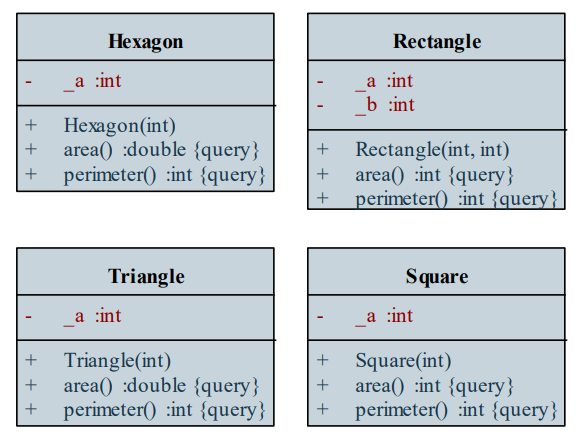
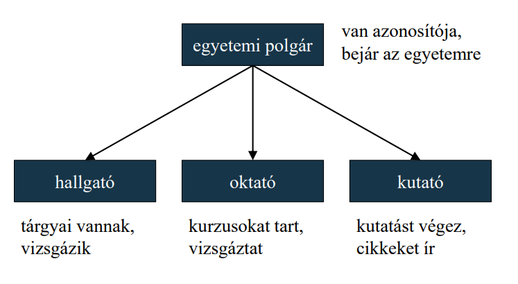
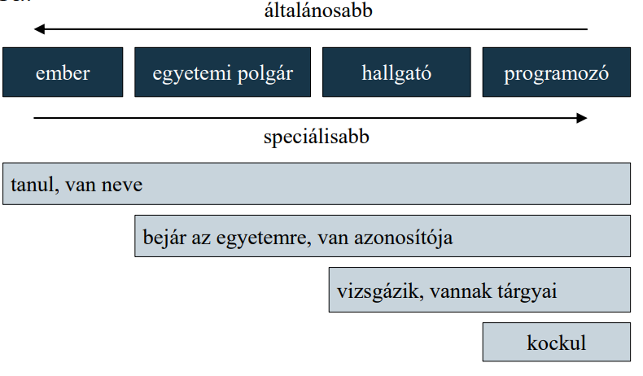
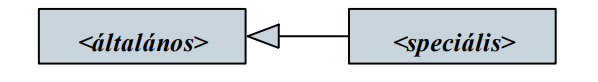
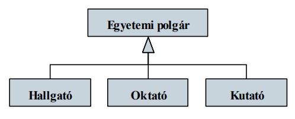

# Objektumorientált tervezés: általánosítás

## 1. Példa

Feladat: Készítsünk egy programot, amelyben különböző geometriai alakzatokat hozhatunk létre (háromszög, négyzet, téglalap, szabályos hatszög), és lekérdezhetjük a területüket, illetve kerületüket.
- a négy alakzatot négy osztály segítségével ábrázoljuk (Triangle, Square, Rectangle, Hexagon)
- a háromszöget, négyzetet, hatszöget egy egész számmal (_a), a téglalapot két számmal (_a, _b) reprezentáljuk
- mindegyik osztálynak biztosítunk lekérdező műveleteket a területre (area) és a kerületre (perimeter)

## 2. Kódismétlődés

Az objektum-orientált programokban a különböző osztályok felépítése, viselkedése megegyezhet
- ez kódismétlődéshez vezet, és rontja a kódminőséget

Hasonlóan procedurális programozás esetén is előfordulhat kódismétlődés, amely alprogramok bevezetésével kiküszöbölhető
- objektumorientált programok esetén a működés szorosan összekötött az adatokkal
- így csak együttesen emelhetőek ki, létrehozva ezzel egy új, általánosabb osztályt, amelyet össze kell kapcsolnunk a jelenlegi, speciálisabb osztállyal

## 3. Általánosabb és speciálisabb osztályok

## 4. Általánosítás

Az általánosabb, illetve speciálisabb osztályok között fennálló kapcsolatot nevezzük általánosításnak (generalization)

 

- a speciális átveszi az általános összes jellemzőjét (tagok, kapcsolatok), amelyeket tetszőlegesen kibővíthet, vagy újrafogalmazhat
- az ellentétes irányú relációt nevezzük specializációnak (specialization)

 

Az általános osztályt ősnek (base, superclass), a speciális osztályt leszármazottnak (descendant, subclass) nevezzük
- ha csak egy szint a különbség, akkor szülőnek (parent), illetve gyereknek (child) nevezzük
- egy osztálynak lehet több szülője, ekkor többszörös általánosításról beszélünk
- nem lehet reflexív, vagy ciklikus
- nincs multiplicitása, elnevezése, szerepei

## 5. Öröklődés

Az általánosítást a programozási nyelvekben az öröklődés (inheritance) technikájával valósítjuk meg, amely lehet
- specifikációs: csak az általános absztrakt jellemezőit (interfészét) veszi át a speciális
- implementációs: az osztály absztrakt és konkrét jellemzőit (interfészét és implementációját) veszi át a speciális

A tagok láthatósága az öröklődés során is szerepet játszik
- a látható (public) tagok elérhetőek lesznek a leszármazottban, a rejtett (private) tagok azonban közvetlenül nem
- ugyanakkor a rejtett tagok is öröklődnek, és közvetetten (örökölt látható műveleteken keresztül) elérhetőek
- sokszor hasznos, ha a leszármazott osztály közvetlenül elérheti a rejtett tartalmat, ezért használhatunk egy harmadik, védett (protected) láthatóságot
    - az osztályban és leszármazottaiban látható, kívül nem
    - az osztálydiagramban # jelöli

Feladat: Készítsünk egy programot, amelyben különböző geometriai alakzatokat hozhatunk létre (háromszög, négyzet, téglalap, szabályos hatszög), és lekérdezhetjük a területüket, illetve kerületüket.
- javítsunk a korábbi megoldáson öröklődés segítségével
- kiemelünk egy általános alakzat osztályt (Shape), amelybe helyezzük a közös adatot (_a), ennek védett (protected) láthatóságot adunk
- a többi osztályban csak az öröklődést jelezzük, a működés nem változik (továbbra is a konstruktorok állítják be _a értékét) 

 

### 5.1. Metódusok viselkedése

Öröklődés során lehetőségünk van a viselkedés újrafogalmazására
- a leszármazottban az ősével megegyező szintaktikájú metódusok vagy elrejtik, vagy felüldefiniálják az örökölt metódusokat
- a leszármazott példányosításakor az ott definiált viselkedés érvényesül

Öröklődés során a leszármazott osztály példányosításakor az ős is példányosodik
- a konstruktor is öröklődik, és meghívódik a leszármazott példányosításakor (implicit, vagy explicit)
- a destruktor is öröklődik, és automatikusan meghívódik a leszármazott megsemmisítésekor

## 6. Polimorfizmus

Mivel a leszármazott példányosításakor egyúttal az ősből is létrehozunk egy példányt, a keletkezett objektum példánya lesz mindkét típusnak
- a leszármazott objektum bárhova behelyettesíthető lesz, ahol az ős egy példányát használjuk

Ezt a jelenséget (altípusos) polimorfizmusnak (polymorphism, subtyping), vagy többalakúságnak nevezzük
- pl. a SubClass sub; utasítással egyúttal a SuperClass példányát is elkészítjük
- öröklődés nélkül is fennállhat dinamikus típusrendszerű programozási nyelvekben (ez a strukturális polimorfizmus)

A programozási nyelvek az objektumokat általában dinamikusan kezelik (referencián, vagy mutatón keresztül)

A polimorfizmus lehetővé teszi, hogy a dinamikusan létrehozott objektumra hivatkozzunk az ősosztály segítségével

A dinamikusan létrehozott objektumot így két típussal rendelkeznek:
- a hivatkozás osztálya az objektum statikus típusa, ezt értelmezi a fordítóprogram, ennek megfelelő tagokat hívhatunk meg
- a példányosított osztály a változó dinamikus típusa, futás közben az annak megfelelő viselkedést végzi

A dinamikus típus futás közben változtatható, mivel az ős típusú hivatkozásra tetszőleges leszármazott példányosítható ugyanakkor a statikus típusra korlátozott az elérhető tagok köre

A polimorfizmus azt is lehetővé teszi, hogy egy gyűjteményben különböző típusú elemeket tároljunk
- a gyűjtemény elemtípusa az ős hivatkozása lesz, és az elemek dinamikus típusát tetszőlegesen váltogathatjuk

## 7. Dinamikus kötés

Dinamikus példányosítást használva a program a dinamikus típusnak megfelelő viselkedést rendeli hozzá az objektumhoz futási idő alatt, ezt dinamikus kötésnek (dynamic binding) nevezzük
- amennyiben felüldefiniálunk (override) egy műveletet, a dinamikus típusnak megfelelő végrehajtás fog lefutni
- ehhez azonban a műveletnek engedélyeznie kell a felüldefiniálást, ekkor beszélünk virtuális (virtual) műveletről
- a nem virtuális műveletek a lezárt, vagy véglegesített (sealed) műveletek, ezeket csak elrejteni lehet, és ekkor a statikus típus szerint fog végrehajtódni a művelet

## 8. Absztrakt osztályok

Amennyiben egy ősosztály olyan általános viselkedéssel rendelkezik, amelyet konkrétan nem tudunk alkalmazni, vagy általánosságban nem tudunk jól definiálni, akkor megtilthatjuk  osztály példányosítását

A nem példányosítható osztályt absztrakt osztálynak (abstract class) nevezzük
- csak statikus típusként szerepelhetnek
- absztrakt osztályban létrehozható olyan művelet, amelynek nincs megvalósítása, csak szintaxisa, ezek az absztrakt, vagy tisztán virtuális műveletek
- a leszármazottak megvalósítják (realize) az absztrakt műveletet (vagy szintén absztrakt osztályok lesznek)
- absztrakt osztály létrehozható a konstruktor elrejtésével, vagy absztrakt művelet definiálásával
- a diagramban dőlt betűvel jelöljük őket

## 9. Interfészek

Amennyiben csak a felületét akarjuk az osztályoknak definiálni, lehetőségünk van interfészek (interface) létrehozására
- egy olyan absztrakt osztályt, amely csak publikus absztrakt műveletekből áll
- célja a különböző feladatkörök elválasztása, a többszörös öröklődés megkönnyítése
- a diagramban az <<interface>> csoportot használjuk, és elhagyjuk adőlt betűket

Amennyiben interfészt specializálunk osztályba, azzal megvalósítjuk (realize, implement) az interfészt 

