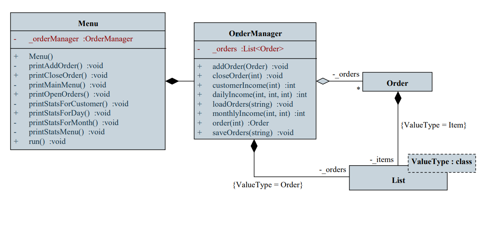

# Objektumorientált tervezés: architektúra

## 1. A tervezés fázisai

A tervezés általában több fázisból épül fel, amely során finomítunk a terven
- mivel már az első fázis alapján beazonosítani a szükséges objektumokat, és azok felépítését meglehetősen nehézkes
- minden fázisban
- bevezethetünk új osztályokat a beazonosított feladatokra
- tovább pontosítjuk a már létező osztályok felépítését, az implementációs megkötéseket
- felbonthatunk osztályokat, amennyiben túl bonyolulttá, túl szerteágazóvá válnak
- összevonhatunk osztályokat, amennyiben túlzottan elaprózódnak

Az objektumok és osztályok azonosításában segítenek
- az objektumorientált tervezés általános elgondolásai (egységbe zárás, öröklődés, …)
- az objektumorientált tervezés alapelvei (SOLID elvek), amelyek általános elvárásokat írnak le
- a tervezési minták, vagy tervminták (design patterns), amelyek jól ismert problémakörökre adnak általánosan megfogalmazott megoldást
- általában egy objektumorientált szerkezetet definiálnak
- a problémakört visszavezetjük a mintára, és megfeleltetéseket teszünk (mint a programozási tételeknél)

## 2. SOLID elvek

**S**ingle responsibility principle (SRP): egy programegység csak egyvalamiért felelhet
- minden komponens, osztály, metódus csak egy felelősségi körrel rendelkezzen, ami megváltoztatásának oka lehet
- így a változtatások csak kis részét érintik a programnak
- sok jól ismert felelősségi kör adott (megjelenítés, adatkezelés, eseménynaplózás, hálózati kapcsolat, …)

**O**pen/closed principle (OCP): a programegységek nyitottak a kiterjesztésre, de zártak a módosításra
- új szolgáltatások hozzáadása ne igényelje a jelenlegi programegységek átírását, inkább újak bevezetését

**L**iskov substitution principle (LSP): az objektumok felcserélhetőek altípusaik példányára a program viselkedésének befolyása nélkül
- minden altípusnak biztosítania kell az ős funkcionalitását azok feltételeinek betartása mellett

**I**nterface segregation principle (ISP): nagy, általános interfészek helyett több, kisebb interfészt használjunk
- így az interfészt megvalósító osztály használója nem függ általa nem igényelt funkcióktól

**D**ependency inversion principle (DIP): függőségeket csak az absztrakciók között állítunk fel, és nem a konkrét megvalósítások között

## 3. Függőségek

Az objektumok között kapcsolatokat definiálhatunk, ez által függőségeket hozunk létre
- egy osztály függ egy másik osztálytól, amennyiben bármilyen módon felhasználja azt

A függőségeket úgy kell kialakítanunk, hogy
- az azonos/hasonló feladatot ellátó osztályok között szoros kapcsolat, nagy fokú együttműködés legyen
- a különböző feladatot ellátó osztályok között laza kapcsolat, kevés együttműködés legyen

Ez nagyban elősegíti a program modularitását, így a későbbi módosíthatóságot, bővíthetőséget

## 4. Architektúra

A szerkezeti (statikus) tervezés leghangsúlyosabb része objektumok, illetve osztályok megtervezése, azonban ez csak egy szempontját jelenti a tervnek. Eleve az osztályok közvetlen meghatározása egy összetett feladat esetén nehézkes lehet.

Szoftver architektúrának nevezzük a szoftver fejlesztése során meghozott elsődleges tervezési döntések halmazát, melyek meghatározzák a rendszer magas szintű felépítését és működését, az egyes alkotóelemek csatlakozási pontjait és megváltoztatásuk később jelentős újratervezését igényelné a szoftvernek.

### 4.1. Monolitikus architektúra

A legegyszerűbb felépítést a monolitikus architektúra (monolithic architecture) adja. Ebben az esetben nincsenek programegységekbe szétválasztva a funkciók, a felületet megjelenítő kód vegyül az adatkezeléssel, a tevékenységek végrehajtásával, stb. 

### 4.2. Kétrétegű architektúra

Összetettebb alkalmazásoknál az egyrétegű felépítés korlátozza a program

- áttekinthetőségét, tesztelhetőségét (pl. nehezen látható át, hol tároljuk a számításokhoz szükséges adatokat)
- módosíthatóságát, bővíthetőségét (pl. nehezen lehet a felület kinézetét módosítani) 
- újrafelhasználhatóságát (pl. komponens kiemelése és áthelyezése másik alkalmazásba)

A legegyszerűbb felbontás a felhasználói kommunikáció (megjelenítés, bemenet) leválasztása a tényleges funkcionalitástól, ezt nevezzük kétrétegű, modell/nézet (MV, model/view) architektúrának.

A modell/nézet architektúrában

- a modell tartalmazza a háttérben futó logikát, azaz a tevékenységek végrehajtását, az állapotkezelést, valamint az adatkezelést, ezt nevezzük alkalmazáslogikának, vagy üzleti logikának
- a nézet tartalmazza a grafikus felhasználói felület megvalósítását, beleértve a vezérlőket és eseménykezelőket
- a felhasználó a nézettel kommunikál, a modell és a nézet egymással
- a modell nem függ a nézettől, függetlenül, önmagában is felhasználható, ezért könnyen átvihető másik alkalmazásba, és más felülettel is üzemképes

### 4.3 Háromrétegű architektúra

A legtöbb alkalmazásban megjelenik a hosszú távú adattárolás, a perzisztencia (persistency) feladatköre

- megadja az adattárolás helyét (fájl, adatbázis, hálózati szerver, …), és formáját (szöveg, XML, SQL, …) 
- általában független a nézettől és a modelltől, ezért külön csomagként kezelendő

A háromrétegű (three-tier) architektúra a leggyakrabban alkalmazott szerkezeti felépítés, amelyben elkülönül: 

- a nézet (presentation/view tier, presentation layer) 
- a modell (logic/application tier, business logic layer) 
- a perzisztencia, vagy adatelérés (data tier, data access layer, persistence layer)

### 4.4 MVC

Asztali környezetben a felhasználó a nézettel teremt kapcsolatot, amely biztosítja a megfelelő utasítás végrehajtását.

Webes környezetben a felhasználó az adott erőforrással teremt kapcsolatot, amit elsősorban az útvonala (URL) határoz meg

- vagyis a felhasználó közvetlenül a vezérlést veszi igénybe
- a vezérlésre az alkalmazásnak egy (új) nézettel kell válaszolnia, ami az adott erőforráshoz tartozik

A modell/nézet/vezérlő (Model-View-Controller, MVC) architektúra egy többrétegű felépítést definiál, amely jól illeszkedik a webes környezethez 

- a vezérlő a kérések kiszolgálója, amely biztosítja a nézetet a kérés eredménye alapján
- a nézet a felület (jórészt deklaratív) definíciója, nem tartalmaz háttérkódot, csupán az adatokat kéri a modelltől 
- a modell a logikai funkciók végrehajtása (üzleti logika) 
- (a nézetmodell egy átjáró, amely az adatokat a nézet számára megfelelő módon prezentálja)
- (a perzisztencia felel az adatelérésért)

## 5. Csomagok

A program szerkezetét csomagokba (package) szervezhetjük, ahol a csomag olyan része az alkalmazásnak, amely
- egy adott feladatcsoporthoz tartozó funkciókat biztosítja, de függhet más csomagoktól
- a csomagokat és függőségeket irányított gráfban ábrázolhatjuk, amelynek körmentesnek kell lennie (DAG) annak érdekében, hogy megfelelő modularitással rendelkezzen a szoftver

## 6. Csomagdiagram

A csomagdiagram (package diagram) célja a rendszer felépítése a logikai szerkezet mentén, azaz az egyes csomagok azonosítása és a csomagba tartozó osztályok bemutatása

A csomagok között is létrehozhatunk kapcsolatokat.

Az osztályok közötti kapcsolatok érvényesek: függőség, asszociáció, általánosítás, megvalósítás:

- használat (use): a csomag felhasznál egy másikat
- beágyazás (nesting): a csomag egy másiknak a része
- importálás (import): a csomag betölti a másikat
- összeillesztés (merge): a csomag tartalmazza, és kibővíti a másik teljes funkcionalitását

A csomagok az osztálydiagramban is feltüntethetőek

## 7. Példa: Marika néni

Feladat: Készítsük el Marika néni kávézójának eladási nyilvántartását végigkövető programot.
- a kávézóban 3 féle étel (hamburger, ufó, palacsinta), illetve 3 féle ital (tea, narancslé, kóla) közül lehet választani
- az ételek ezen belül különfélék lehetnek, amelyre egyenként lehet árat szabni, és elnevezni, az italok árai rögzítettek
- a program kezelje a rendeléseket, amelyekben tetszőleges tételek szerepelhetnek, illetve a rendelés kapcsolódhat egy törzsvásárlóhoz
- biztosítsunk lehetőséget a függőben lévő rendeléseket lekérdezésére, valamint napi, havi és törzsvásárolói számra összesített nettó/bruttó fogyasztási statisztikák követésére

## 7.1. Használati esetek diagram

## 7.2. Szerkezeti tervezés

A programban rendeléseket kezelünk, amelyek tetszőleges sok tételből állhat
- a tételek a hamburger, ufó, palacsinta, kóla, narancs, tea, amelyek mind nagyon hasonlóak, csak néhány részletben térnek el
- a rendelésekhez tartozható törzsvásárlói szám, illetve lehet lezárt, vagy folyamatban lévő

Rendelések sorozatával dolgozunk, amelyek száma folyamatosan bővül, a rendeléseket betölthetjük, és menthetjük

A felhasználói interakciót egy menün keresztül biztosítjuk, amely megjeleníti a tartalmat, és fogadja a felhasználói bevitelt

Tétel (Item):
- minden esetben ismert a név, a bruttó és a nettó ár, ami könnyen számolható a bruttóból
- az italoknál ezek az adatok típustól függenek (így nem kell tárolnunk őket), ételek esetén változhatnak

Rendelés (Order):
- adatai a sorszám (ez automatikusan generált), a törzsvásárlói szám és a dátum, valamint az állapota (lezárt-e)
- lehetőséget ad új tétel felvételére, nettó/bruttó érték lekérdezésére 
- a tételeket kezelhetjük egy listában

Rendeléskezelő (Orders helyett OrderManager):
- kezeli a rendelések listáját, lehet felvenni (addOrder), és lekérdezni (order) rendeléseket
- biztosítja a statisztikák lekérdezését (monthlyIncome, dailyIncome, …)
- lehetőséget ad adatok betöltésére (loadOrders), mentésére (saveOrders)

Menü (Menu):
- biztosítja a futtatás lehetőségét (run)
- több menüpontra tagolódik (printMainMenu, …)

## 7.2.1. Kétrétegű architektúrával

Az alkalmazásban a Menu osztály biztosítja a nézetet, míg a további osztályok a funkcionalitását látják el, azért azok a modellt alkotják.

## 7.2.2. Háromrétegű architektúrával

Az alkalmazást háromrétegű architektúrában valósítjuk meg, a perzisztencia (OrderPersistence) felel az adatok mentéséért, betöltéséért

## 8. Példa: Utazási ügynökség

Feladat: Készítsük el egy utazási ügynökség apartmanokkal foglalkozó rendszerét.
- az apartmanok épületekben találhatóak, amelyek városokban helyezkednek el
- az épületek különböző adatokkal (leírás, szolgáltatások, pontos hely, tengerpart távolság, …), valamint képekkel rendelkeznek
- a vendégek számára biztosítsunk egy webes felületet, amelyen keresztül apartmanokat kereshetnek, foglalhatnak
- a munkatársak számára biztosítsunk egy alkalmazást, amelyben szerkeszthetik az apartmanok adatait, képeit, valamint kezelhetik a foglalásokat

## 8.1. Használati esetek diagram

## 8.2. Szerkezeti tervezés

A webes felületet MVC architektúrában valósítjuk meg 
- a felületet egy vezérlő (HomeController) irányítja, amely három akciót definiál: minden listázása (Index), egy város épületeinek listázása (List), egy épület részleteinek lekérése (Details)
- egy vezérlő a foglalásokat felügyeli (RentController), két nézettel
- egy vezérlőben (AccountController) kezeljük a regisztráció (Register), bejelentkezés (Login) és kijelentkezés (Logout) funkciókat, amelyekhez két új nézetet készítünk
- …

