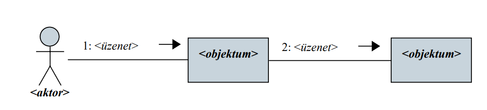
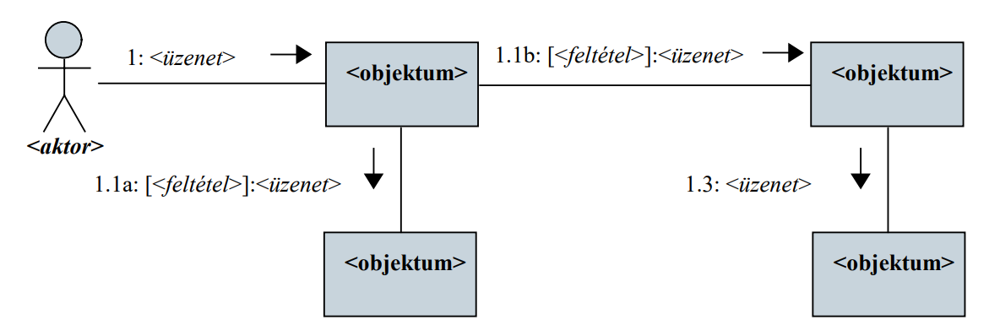
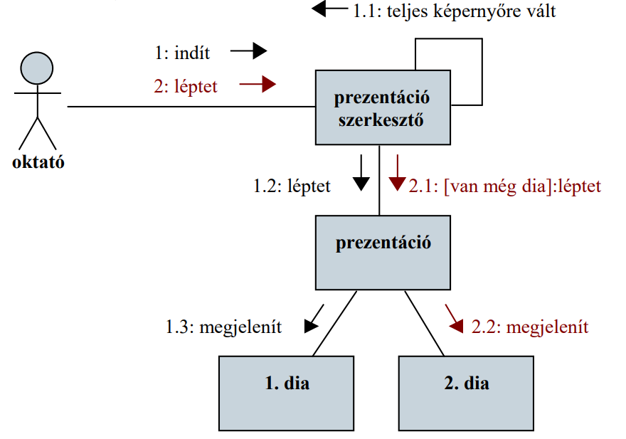
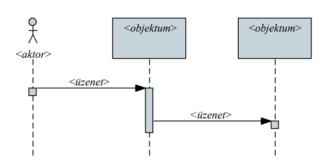
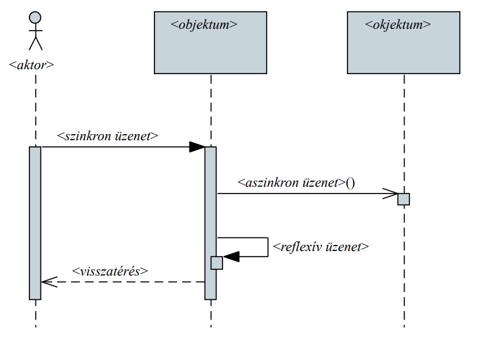
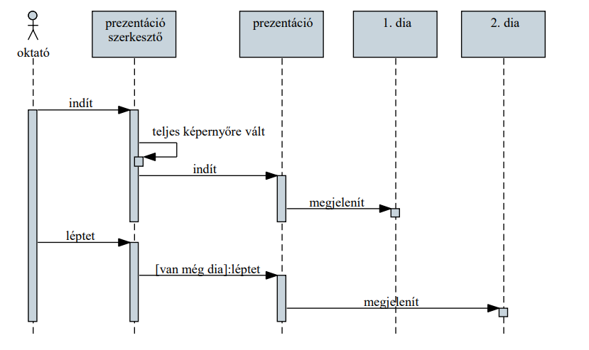
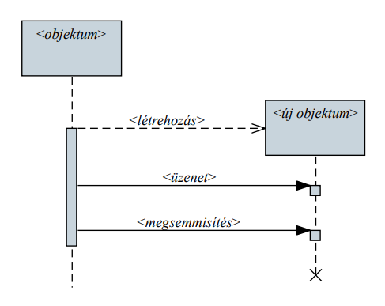
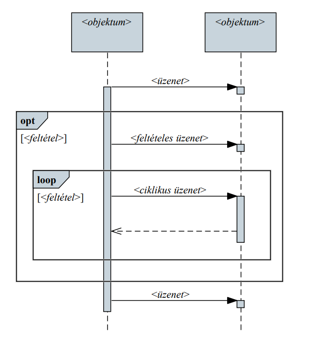

# Objektumorientált tervezés: végrehajtás

## Végrehajtás modellezése

Az objektumorientált programokat egymással kapcsolatban álló objektumok alkotják
- a lehetséges kommunikációs pontokat az osztálydiagramban feltérképeztük
- azonban a végrehajtás sorrendjére, időbeli lefolyására az osztálydiagram nem ad támpontot
- az állapotdiagram csak egy osztály szemszögéből jellemzi a működést, és elsősorban nem a végrehajtást modellezi

A program működése során történő, objektumok és osztályok közötti interakciós folyamatokat kommunikációs, szekvencia, illetve tevékenység diagrammal modellezhetjük

## Kommunikációs diagram

Az UML kommunikációs diagram (communications diagram) célja az objektumok közötti kommunikáció sorrendjének megállapítása
- ábrázolja az objektumokat és a köztük lévő kommunikációt, üzenetátadást (metódushívás, eseménykiváltás)
- az objektumok mellett szerepeltetheti a rendszer aktorait is, amelyek kezdeményezhetik az üzenetátadást
- az üzenetekhez rendel irányt és sorrendiséget

A kommunikációban ábrázolhatjuk
- a csoportokat, amelyek az egy híváslánchoz tartozó üzenetek (<csoport>.<sorszám> formátumban)
- az elágazásokat (<sorszám><ág> formátumban)
- a feltételeket ([<feltétel>] formátumban)

A kommunikációt az objektumok szemszögéből ábrázoljuk 
- általában nem a teljes rendszer kommunikációját, csak egy leszűkített részét ábrázoljuk, amelyben egy megadott forgatókönyvet követünk
- pl. egy adott használati eset (funkció) teljesítésének megvalósítását adott feltételek mellett
- nem tartalmaz feltételt, ciklust, és nem látható az objektumok élettartama

Segíthet az objektumok viselkedési mintájának meghatározásában (ugyanakkor a pontos ábrázoláshoz szükséges a statikus szerkezet)

## Szekvencia diagram

Az UML szekvencia diagram (sequence diagram) célja az objektumok közötti interakció időrendi ábrázolása
- tartalmazza a kommunikációs diagram elemeit, ugyanakkor nem sorrendiséget ad a kommunikációra, hanem időbeli lefolyást ábrázol

A szekvenciában az objektumok (és az aktorok)
- életvonallal (lifeline) rendelkeznek, amely meghatározza létezésük időtartamát
- lehetnek aktívak, ekkor képesek kommunikáció kezdeményére

A szekvenciában az üzeneteknek különböző típusait tudjuk ábrázolni
- szinkron üzenet: feldolgozását (végrehajtása) a hívó megvárja, addig nem végez további műveleteket
- aszinkron üzenet: feldolgozását a hívó nem várja meg, hanem tovább tevékenykedik
- visszatérési üzenet: egy korábbi üzenet feldolgozásának eredménye

Példa: prezentáció

A szekvencia során üzenet segítségével
- létrehozhatunk új objektumokat (a konstruktorral), ekkor elindul az életvonaluk
- megsemmisíthetünk objektumokat (a destruktorral), ekkor vége az életvonaluknak
- kommunikálhatunk az objektumokkal a két üzenet között

A szekvencia során ábrázolhatunk
- feltételes szakaszt (opt), amely csak a feltétel teljesülésekor hajtódik végre
- elágazást (alt), ahol a feltétel függvényében különböző ágakat hajthatunk végre
- ciklust (loop), ahol a tevékenységet a feltétel függvényében többször is végrehajtjuk
- párhuzamos szakaszt (par), ahol egyszerre párhuzamosan végezzük a tevékenységeket
- kritikus szakaszt (critical), amely nem végezhető párhuzamosan

