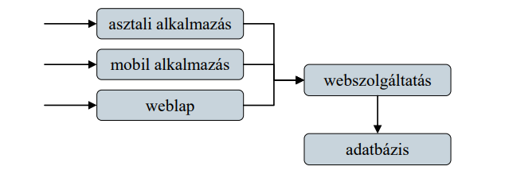
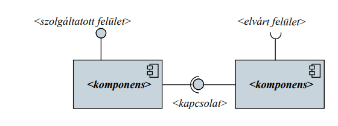
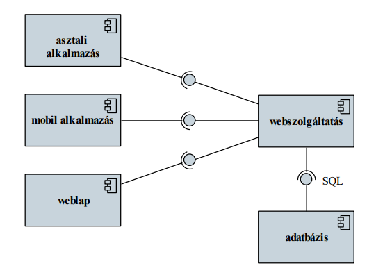
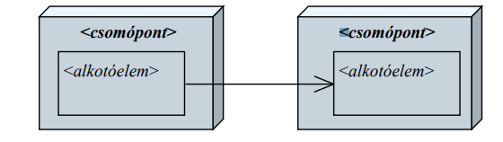
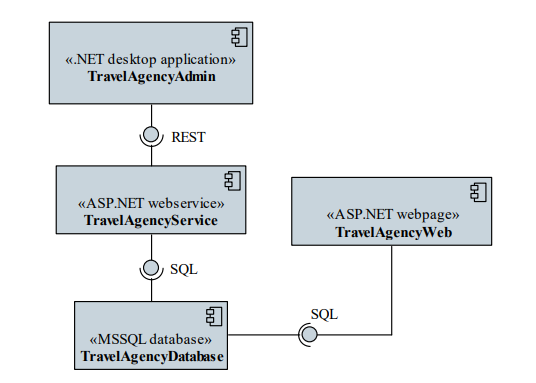
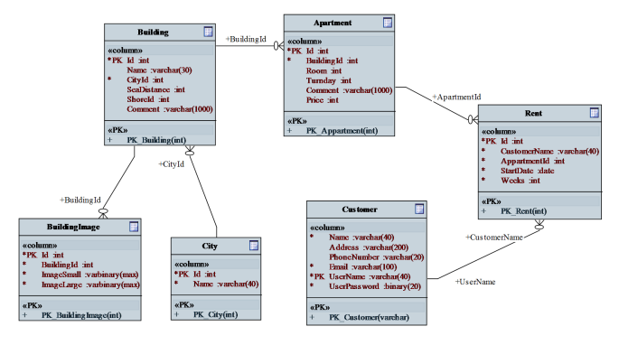

# Tervezés

## 1. Szoftverrendszer
Szoftvernek nevezzük a program(ok), dokumentáció(k),
konfiguráció(k), valamint adatok együttese
- mivel a megoldandó feladatok összetettek lehetnek, a megoldást
nem feltétlenül egy program, hanem több program tudja megadni
- a végrehajtás során ezek a programok egymással kommunikálnak
(adatot cserélnek) 
Egymással kommunikáló programok alkotta szoftvereket nevezzük
szoftverrendszernek (software system)
- a rendszerben jelen lévő programokat nevezzük a rendszer
komponenseinek (component)

## 2. Komponensek
A szoftver komponens egy adott funkcionalitásért felelő, fizikailag
elkülönülő része a rendszernek
- önállóan (újra)felhasználható, telepíthető
- belső működése rejtett, a kapcsolatot megfelelő interfészen
(interface) keresztül teremti meg
- szolgáltathat olyan funkcionalitást, amelyet más komponensek
használnak fel, ehhez tartozik egy szolgáltatott interfész
(provided interface)
- felhasználhat más komponenseket, amelyek funkcionalitását egy
elvárt interfész (required interface) keresztül érhetik el

Egy szoftverrendszerben számos komponens található, pl.
- mobil alkalmazás, asztali alkalmazás, weblap (biztosítják a
kapcsolatot a felhasználóval)
- webszolgáltatás (gondoskodik az adatok továbbításáról)
- adatbázis (gondoskodik az adatok megfelelő tárolásáról)

Egy alkalmazás is felbontható komponensekre, amennyiben egyes
részeit újrafelhasználhatóvá szeretnénk tenni
- Egy alkalmazás komponensei lehetnek:
- végrehajtható állomány (executable), amely biztosítja a belépési
pontot az alkalmazásba
- programkönyvtár (library), amely adott funkcionalitások
gyűjteménye (nem végrehajtható), objektumorientált
környezetben osztályok gyűjteménye (class library)

## 3. Komponensdiagram
A szoftverrendszer komponenseit UML komponensdiagram
(component diagram) segítségével ábrázolhatjuk
- ismerteti a rendszer komponenseit, a szolgáltatott/elvárt
interfészeket és a közöttük fennálló kapcsolatokat (connector)
- a komponens diagramnak osztálydiagram elemeket is
elhelyezhetünk (pl. interfész külön megjeleníthető)

Példa:

## 4. Telepítési diagram
A szoftverrendszerek komponensei akár különböző hardver
eszközökre is kihelyezhetőek, amelyeken interakcióba lépnek a
környezetükkel (más szoftverekkel)
A szoftverrendszert kihelyezési és környezeti szempontból az UML
telepítési diagram (deployment diagram) ábrázolja
- ismerteti azon csomópontokat (node), amelyekre az egyes
alkotóelemei (artifact) találhatóak

A rendszer alkotóeleme lehet bármilyen, fizikailag elkülönülő
tartozéka a szoftvernek
- pl. mobil alkalmazás, weblap, kódfájl, adatfájl, adatbázis,
konfigurációs fájl
- a komponenseket jelölhetjük komponensként
A rendszer csomópontja lehet:
- egy hardver eszköz (device), amelyen futtatjuk a szoftvert pl.
mobiltelefon, szerver gép
- egy végrehajtási környezet (execution environment), amely
biztosítja szoftverek futtatását, pl. webszerver, virtuális gép,
adatbázis-kezelő

## 5. Adatformátumok
A szoftverrendszer tervezése (system design) mellett foglalkoznunk
kell a rendszer által kezelt adatok kezelésének módjával,
formátumának meghatározásával, ez az adattervezés (data design)
- minden, a szoftver (vagy komponensei) számára bemenetként,
vagy kimenetként szolgáló adat formátumát, felépítését meg kell
adnunk (pl. adatfájl, adatbázis, konfigurációs fájl, felhasználó
által letölthető adatok)
- összetett adatok esetén támaszkodhatunk létező formátumokra
(pl. CSV, XML, JSON), vagy létrehozhatunk egyedi formátumot
- az adattervezés is megfelelő modellekkel rendelkezik (pl.
adatbázisok tervezhetőek egyed-kapcsolati modellel, vagy UML
adatmodellel)

- példák!

## 6. Utazási ügynökség - példa

### 6.1. Feladat
Készítsük el egy utazási ügynökség apartmanokkal foglalkozó
rendszerét.
- az apartmanok épületekben találhatóak, amelyek városokban
helyezkednek el
- az épületek különböző adatokkal (leírás, szolgáltatások, pontos
hely, tengerpart távolság, …), valamint képekkel rendelkeznek
- a vendégek számára biztosítsunk egy webes felületet, amelyen
keresztül apartmanokat kereshetnek, foglalhatnak
- a munkatársak számára biztosítsunk egy alkalmazást, amelyben
szerkeszthetik az apartmanok adatait, képeit, valamint kezelhetik
a foglalásokat

### 6.2. Tervezés
A rendszerben található egy webes, valamint egy adminisztrációs
kliens, amelyet külön alkalmazások valósítanak meg
- A webes kliens egy weblap, amelyet egy webszerverrel futtatunk, és
ASP.NET keretrendszer segítségével valósítjuk meg
- Az adminisztrációs kliens egy asztali alkalmazás, amelyet .NET
keretrendszerben valósítunk meg, ezért a .NET virtuális gépe (CLR)
futtatja
- A két alkalmazás közös adatokat használ, amelyeket relációs
adatbázisban tárolunk, ehhez MSSQL-t használunk
A weblap és az adatbázis egy közös szerveren helyezkedik el, így a
weblap közvetlenül hozzáfér az adatbázishoz
- Az asztali alkalmazás más számítógépen fog futni, ezért biztonsági
okokból nem férhet hozzá közvetlenül az adatbázishoz, a
hozzáféréshez közbeiktatunk egy webszolgáltatást
- A webszolgáltatást egy webszerverrel futtatjuk, és ASP.NET
WebAPI keretrendszer segítségével valósítjuk meg

Komponensdiagram

Telepítési diagram

Adattárolás

Az adatbázisban a következő séma szerint tároljuk az adatokat:
- városok (city): azonosító, városnév;
- épületek (building): azonosító, név, város azonosító, utca,
tengerpart távolság, tengerpart-típus (számként), jellemzők
(binárisan összeillesztve), megjegyzés;
- apartmanok (appartment): azonosító, épület azonosító, szám,
ágyak száma, pótágyak száma, felújítás alatt van-e;
- ügyfelek (customer): azonosító, név;
- …

## 7. Rendszerterv

A tervezés eredménye a szoftver rendszerterve (software design
description, SDD), amely tartalmazza:
- a program statikus szerkezetét, azaz a programegységek feladatát,
részletes leírását és a köztük lévő relációkat
- a program dinamikus szerkezetét, azaz a program eseményeinek
kiváltódását és hatásait, a programegységek állapotainak
változását, az üzenetküldések megvalósítását
- a tárolt, kezelt, és eredményül adott adatok formáját, leírását
- a programok belső és külső interfészeinek leírását
- ajánlásokat az implementáció számára (stratégia, függőségek,
programozási nyelv, tesztelési módszerek)

A rendszerterv felépítése:
1. előszó (célközönség, dokumentum-történet)
2. bevezetés (szoftver célja, helye, szükségessége, előnyei, fejlesztési módszertan)
3. fogalomtár (technikai áttekintés)
4. rendszer architektúra (magas szintű áttekintés, UML csomag-, komponens-, állapotdiagram)
    - architektúrális minták
    - funkcionális megfeleltetés
5. adattervezés (adattárolás, formátumok leírása)

6. rendszer tervezés (alacsony szintű áttekintés)
    - statikus terv (UML osztály-, objektumdiagram)
    - dinamikus terv (UML állapot-, szekvencia- és aktivációs
diagram)
    - interfész leírás
    - felhasznált algoritmusok és minták
7. felhasználói felület (áttekintés, felületi terv)
8. implementációs ajánlások
9. függelék (pl. adatbázis terv, becsült hardver szükségletek)
10. tárgymutató

