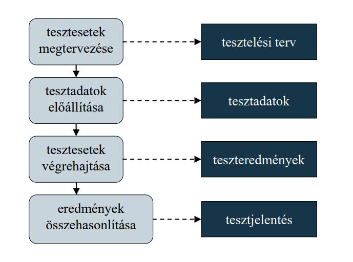
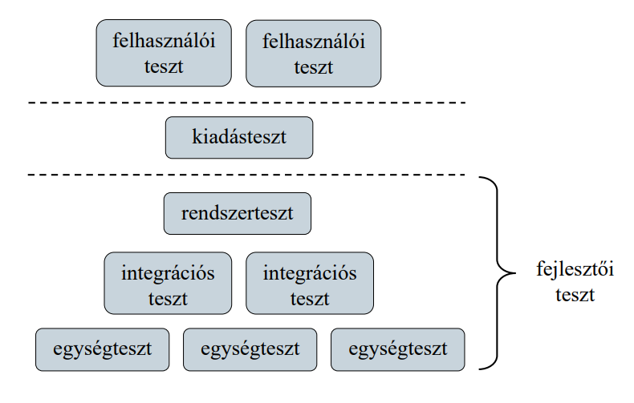
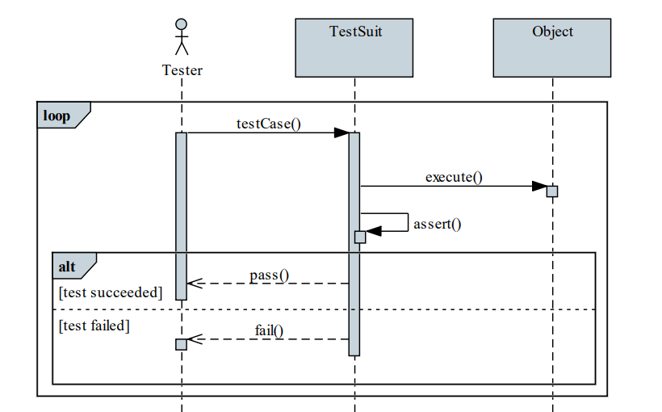
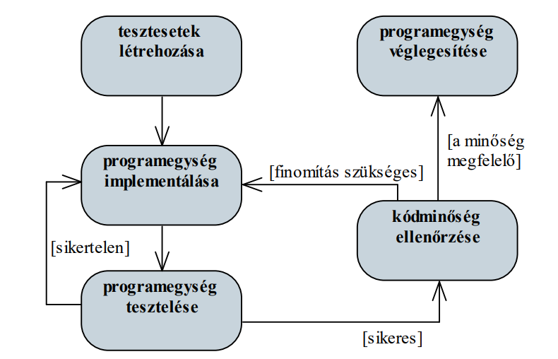
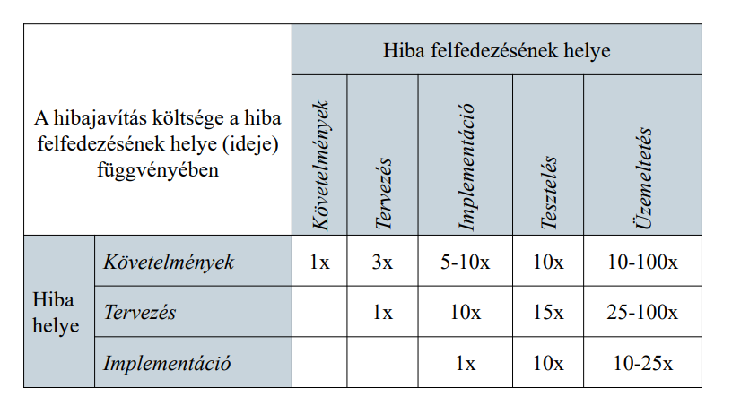

# Tesztelés

## Verifikáció és validáció

A szoftver verifikációja és validációja, vagy minőségbiztosítása (quality control) azon folyamatok összessége, amelyek során ellenőrizzük, hogy a szoftver teljesíti-e az elvárt követelményeket, és megfelel a felhasználói elvárásoknak 
- a verifikáció (verification) ellenőrzi, hogy a szoftvert a megadott funkcionális és nem funkcionális követelményeknek megfelelően valósították meg 
    - történhet formális, vagy szintaktikus módszerekkel
- a validáció (validation) ellenőrzi, hogy a szoftver megfelel-e a felhasználók elvárásainak, azaz jól specifikáltuk-e eredetileg a követelményeket
    - alapvető módszere a tesztelés
	
### Módszerei

Az ellenőrzés végezhető
- statikusan, a modellek és a programkód áttekintésével
    - elvégezhető a teljes program elkészülte nélkül is
    - elkerüli, hogy hibák elfedjék egymást
    - tágabb körben is felfedhet hibákat, pl. szabványoknak történő megfelelés
- dinamikusan, a program futtatásával
    - felfedheti a statikus ellenőrzés során észre nem vett hibákat, illetve a programegységek együttműködéséből származó hibákat
    - lehetőséget ad a teljesítmény mérésére
	
## Célja
A tesztelés célja a szoftverhibák felfedezése és szoftverrel szemben
támasztott minőségi elvárások ellenőrzése
- futási idejű hibákat (failure), működési rendellenességeket
(malfunction) keresésünk, kompatibilitást ellenőrzünk
- általában a program (egy részének) futtatásával, szimulált adatok
alapján történik
- nem garantálja, hogy a program hibamentes, és minden
körülmény között helyáll, de felfedheti a hibákat adott
körülmények között

ISTQB erroe, defct, stb

## Teszteslési terv és tesztesetek
A teszteléshez tesztelési tervet (test plan) készítünk, amely ismerteti
a tesztelés felelőseit, folyamatát, technikáit és céljait.

A tesztelés során különböző teszteseteket (test case) különböztetünk
meg, amelyek az egyes funkciókat, illetve elvárásokat tudják
ellenőrizni
- megadjuk, adott bemenő adatokra mi a várt eredmény (expected
result), amelyet a teszt lefutása után összehasonlítunk a kapott
eredménnyel (actual result)
- a teszteseteket összekapcsolhatjuk a követelményekkel, azaz
megadhatjuk melyik teszteset milyen követelményt ellenőriz
(traceability matrix)
- a tesztesetek gyűjteményekbe helyezzük (test suit)

A tesztesetek eredményeiből készül a tesztjelentés (test report)

## A tesztelési folyamat

## Tesztelés lépései

A tesztelés nem a teljes program elkészülte után, egyben történik,
hanem általában 3 szakaszból áll:
1. fejlesztői teszt (development testing): a szoftver fejlesztői
ellenőrzik a program működését
    - jellemzően fehér doboz (white box) tesztek, azaz a fejlesztő
ismeri, és követi a programkódot
2. kiadásteszt (release testing): egy külön tesztcsapat ellenőrzi a
szoftver használatát
3. felhasználói teszt (acceptance testing): a felhasználók tesztelik a
programot a felhasználás környezetében
    - jellemzően fekete doboz (black box) tesztek, azaz a
forráskód nem ismert

A fejlesztői tesztnek további négy szakasza van:
- egységteszt (unit test): a programegységeket (osztályok,
metódusok) külön-külön, egymástól függetlenül teszteljük
- integrációs teszt (integration test): a programegységek
együttműködésének tesztje, a rendszer egy komponensének
vizsgálata
- rendszerteszt (system test): az egész rendszer együttes tesztje, a
rendszert alkotó komponensek közötti kommunikáció vizsgálata
- A tesztelés egy része automatizálható, bizonyos részét azonban
mindenképpen manuálisan kell végrehajtanunk

## Nyomonkövetés

A tesztelést elősegíti a nyomkövetés (debugging), amely során a
programot futás közben elemezzük, követjük a változók állapotait, a
hívás helyét, felfedjük a lehetséges hibaforrásokat

A jellemző nyomkövetési lehetőségek:
- megállási pontok (breakpoint) elhelyezése
-  változókövetés (watch), amely automatikus a lokális változókra,
szabható rá feltétel
- hívási lánc (call stack) kezelése, a felsőbb szintek változóinak
nyilvántartásával
A fejlesztőkörnyezetbe épített eszközök mellett külső programokat is
használhatunk (pl. gdb)

## Egységtesztek
Az egységteszt során törekednünk kell arra, hogy a programegység
összes funkcióját ellenőrizzük, egy osztály esetén
- ellenőrizzük valamennyi (publikus) metódust
- állítsuk be, és ellenőrizzük az összes mezőt
- az összes lehetséges állapotba helyezzük az osztályt, vagyis
szimuláljuk az összes eseményt, amely az osztályt érheti

A teszteseket célszerű leszorítani a programegység által
- megengedett bementre, így ellenőrizve a várt viselkedését
(korrektség)
- nem megengedett bemenetre, így ellenőrizve a hibakezelést
(robosztusság)

A bemenő adatokat részhalmazokra bonthatjuk a különböző
hibalehetőségek függvényében, és minden részhalmazból egy
bemenetet ellenőrizhetünk

Pl. egy téglalap méretei egész számok, amelyek lehetnek
- negatívak, amely nem megengedett tartomány
- nulla, amely megengedhető (üres téglalap)
- pozitívak, amelyek megengedettek, ugyanakkor speciális esetet
jelenthetnek a nagy számok

Az egységtesztet az ismétlések és a számos kombináció miatt
célszerű automatizálni (pl. a teszt implementációjával)

## Teszteslési keretrendszerek

Az egységtesztek automatizálását, és az eredmények kiértékelését
hatékonyabbá tehetjük tesztelési keretrendszerek (unit testing
frameworks) használatával

- általában a tényleges főprogramoktól függetlenül építhetünk
teszteseteket, amelyeket futtathatunk, és megkapjuk a futás
pontos eredményét
- a tesztestekben egy, vagy több ellenőrzés (assert) kap helyet,
amelyek jelezhetnek hibákat
- amennyiben egy hibajelzést sem kaptunk egy tesztesettől, akkor
az eset sikeres (pass), egyébként sikertelen (fail)
- pl. JUnit, CppTest, QTestLib

## Kód lefedettség

A tesztgyűjtemények által letesztelt programkód mértékét nevezzük
kód lefedettségnek (code coverage)
- megadja, hogy a tényleges programkód mely részei kerültek
végrehajtásra a teszt során
- számos szempont szerint mérhető, pl.
    - alprogram (function): mely alprogramok lettek végrehajtva
    - utasítás (statement): mely utasítások lettek végrehajtva
    - elágazás (branch): az elágazások mely ágai futottak le
    - feltételek (condition): a logikai kifejezések mely részei lettek
kiértékelve (mindkét esetre)

Az integrációs és rendszertesztek során elsősorban azt vizsgáljuk,
hogy a rendszer megfelel-e a követelménybeli elvárásoknak
- funkcionális és nem funkcionális alapon (pl. teljesítmény,
biztonság) is ellenőrizhetjük a rendszert
- ezeket a teszteseteket már a specifikáció során megadhatjuk
- a tesztelés első lépése a füst teszt (smoke test), amely során a
legalapvetőbb funkciók működését ellenőrzik

A kiadásteszt és a felhasználói teszt során a szoftvernek már
általában a célkörnyezetben, tényleges adatokkal kell dolgoznia
- a teszt magába foglalja a kihelyezést (pl. telepítés) is

## Programváltozatok
Az implementáció és tesztelés során a szoftver különböző változatait
tartjuk nyilván:
- pre-alfa: funkcionálisan nem teljes, de rendszertesztre alkalmas
- alfa: funkcionálisan teljes, de a minőségi mutatókat nem teljesíti
- béta: funkcionálisan teljes, és a minőségi mutatók javarészt
megfelelnek a követelményeknek
    - a további tesztelés során nagyrészt a rendellenességek
kiküszöbölése folyik, a tesztelés lehet publikus
    - esetlegesen kiegészítő funkciók kerülhetnek implementálásra
- kiadásra jelölt (release candidate, RC), vagy gamma:
funkcionálisan teljes, minőségi mutatóknak megfelelő
    - kódteljes (nem kerül hozzá újabb programkód, legfeljebb
hibajavítás)
    - csak dinamikus tesztelés folyik, és csak kritikus hiba esetén
nem kerül gyártásra
- végleges (final, release to manufacturing, RTM): a kiadott,
legyártott változat
    - nyílt forráskód esetén általában már korábban publikussá
válik a (félkész) szoftver
    - a kiadást követően a program további változásokon eshet át
(javítások, programfunkció bővítés)

## Teljesítménytesztek
A teljesítménytesztek (performance test) során a rendszer
teljesítményét mérjük
- ezáltal a rendszer megbízhatóságát és teljesítőképességének
(válaszidők, átviteli sebességek, erőforrások felhasználása)
ellenőrizzük különböző mértékű feladatvégzés esetén
- végezhetünk teszteket a várható feladatmennyiség függvényében
(load test), vagy azon túl ellenőrizhetjük a rendszer
tűrőképességét (stress test)
 a teljesítményt sokszor a hardver erőforrások függvényében
végezzük, amellyel megállapítható a rendszer skálázhatósága
(capacity test)

## TDD - Tesztvezérelt fejlesztés
A tesztvezérelt fejlesztés (test-driven development, TDD) egy olyan
fejlesztési módszertan, amely a teszteknek ad elsőbbséget a fejlesztés
során

A fejlesztés lépései:
1. tesztesetek elkészítése, amely ellenőrzi az elkészítendő kód
működését
2. az implementáció megvalósítása, amely eleget tesz a
teszteset ellenőrzéseinek
3. az implementáció finomítása a minőségi elvárásoknak
(tervezési és fejlesztési elvek) megfelelően

Előnye, hogy magas fokú a kód lefedettsége, mivel a teszteknek
minden funkcióra ki kell térniük

## A hibajavítás költségei

