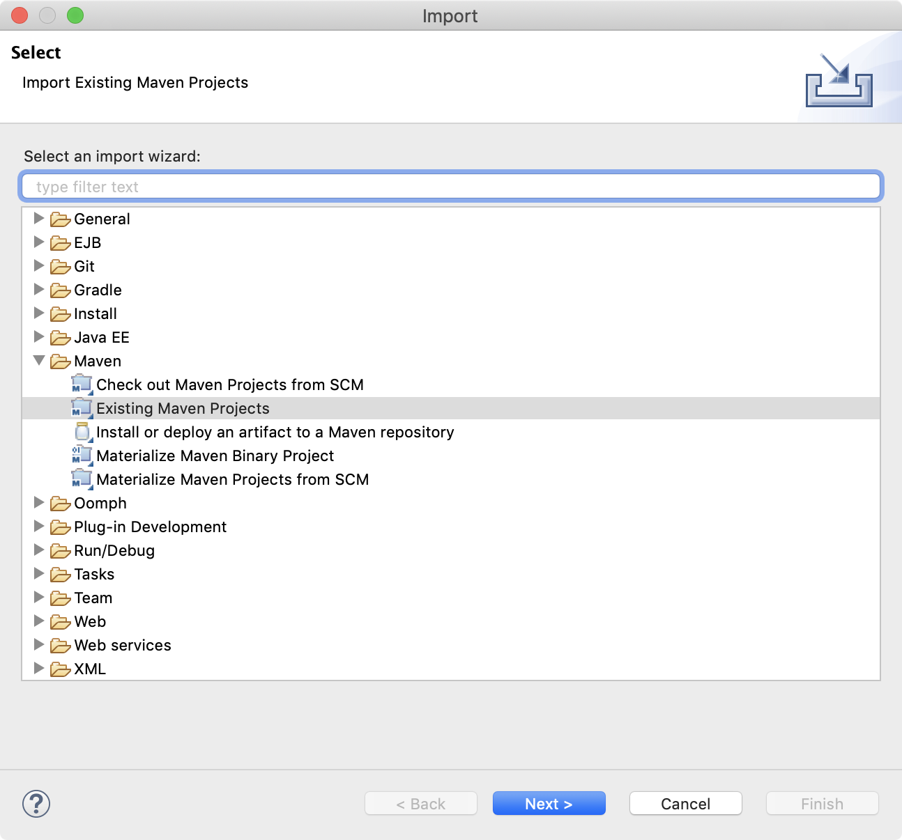

# Spring MVC alkalmazás

## 1. Elméleti háttér

A szerkezeti (statikus) tervezés leghangsúlyosabb része objektumok, illetve osztályok megtervezése, azonban ez csak egy szempontját jelenti a tervnek. Eleve az osztályok közvetlen meghatározása egy összetett feladat esetén nehézkes lehet.

Szoftver architektúrának nevezzük a szoftver fejlesztése során meghozott elsődleges tervezési döntések halmazát, melyek meghatározzák a rendszer magas szintű felépítését és működését, az egyes alkotóelemek csatlakozási pontjait és megváltoztatásuk később jelentős újratervezését igényelné a szoftvernek.

### 1.1. Monolitikus architektúra

A legegyszerűbb felépítést a monolitikus architektúra (monolithic architecture) adja. Ebben az esetben nincsenek programegységekbe szétválasztva a funkciók, a felületet megjelenítő kód vegyül az adatkezeléssel, a tevékenységek végrehajtásával, stb. 


### 1.2. Kétrétegű architektúra

Összetettebb alkalmazásoknál az egyrétegű felépítés korlátozza a program

- áttekinthetőségét, tesztelhetőségét (pl. nehezen látható át, hol tároljuk a számításokhoz szükséges adatokat)
- módosíthatóságát, bővíthetőségét (pl. nehezen lehet a felület kinézetét módosítani) 
- újrafelhasználhatóságát (pl. komponens kiemelése és áthelyezése másik alkalmazásba)

A legegyszerűbb felbontás a felhasználói kommunikáció (megjelenítés, bemenet) leválasztása a tényleges funkcionalitástól, ezt nevezzük kétrétegű, modell/nézet (MV, model/view) architektúrának.

A modell/nézet architektúrában

- a modell tartalmazza a háttérben futó logikát, azaz a tevékenységek végrehajtását, az állapotkezelést, valamint az adatkezelést, ezt nevezzük alkalmazáslogikának, vagy üzleti logikának
- a nézet tartalmazza a grafikus felhasználói felület megvalósítását, beleértve a vezérlőket és eseménykezelőket
- a felhasználó a nézettel kommunikál, a modell és a nézet egymással
- a modell nem függ a nézettől, függetlenül, önmagában is felhasználható, ezért könnyen átvihető másik alkalmazásba, és más felülettel is üzemképes


### 1.3 Háromrétegű architektúra

A legtöbb alkalmazásban megjelenik a hosszú távú adattárolás, a perzisztencia (persistency) feladatköre

- megadja az adattárolás helyét (fájl, adatbázis, hálózati szerver, …), és formáját (szöveg, XML, SQL, …) 
- általában független a nézettől és a modelltől, ezért külön csomagként kezelendő

A háromrétegű (three-tier) architektúra a leggyakrabban alkalmazott szerkezeti felépítés, amelyben elkülönül: 

- a nézet (presentation/view tier, presentation layer) 
- a modell (logic/application tier, business logic layer) 
- a perzisztencia, vagy adatelérés (data tier, data access layer, persistence layer)


### 1.4 MVC

Asztali környezetben a felhasználó a nézettel teremt kapcsolatot, amely biztosítja a megfelelő utasítás végrehajtását.

Webes környezetben a felhasználó az adott erőforrással teremt kapcsolatot, amit elsősorban az útvonala (URL) határoz meg

- vagyis a felhasználó közvetlenül a vezérlést veszi igénybe
- a vezérlésre az alkalmazásnak egy (új) nézettel kell válaszolnia, ami az adott erőforráshoz tartozik


A modell/nézet/vezérlő (Model-View-Controller, MVC) architektúra egy többrétegű felépítést definiál, amely jól illeszkedik a webes környezethez 

- a vezérlő a kérések kiszolgálója, amely biztosítja a nézetet a kérés eredménye alapján
- a nézet a felület (jórészt deklaratív) definíciója, nem tartalmaz háttérkódot, csupán az adatokat kéri a modelltől 
- a modell a logikai funkciók végrehajtása (üzleti logika) 
- (a nézetmodell egy átjáró, amely az adatokat a nézet számára megfelelő módon prezentálja)
- (a perzisztencia felel az adatelérésért)


## 2. Projektalap összeállítása

### 2.1. Projektalap generálása

Nyissuk meg a [Spring Initializr](https://start.spring.io/) oldalát.


Válasszuk az alábbi beállításokat egy új projekt létrehozásához:

- **Project**: Maven project
- **Spring Boot**: 2.3.1
- **Language**: Java
- **Project Metadata**:
  - **Group**: com.example
  - **Artifact**: {alkalmazásunk neve, rövid, végig kisbetűs, csak [a-z] karaktereket tartalmaz, és lehetőleg angolul van }
  - **Name**: {alkalmazásunk neve}
  - **Description**: {alkamazásunk leírása}
  - **Package name**: (automatikusan generálja)
  - **Packaging**: Jar
  - **Java**: 8

Ezek után lehetőség van még további függőségeket hozzáadni, a legszükségesebbek:

- **Spring Web**
- **Thymeleaf**
- **Lombok**

Ezeket az oldal jobb felső részén található gomb megnyomásával feltűnő **dialógus ablak** segítségével adhatjuk hozzá. A megjelenő dialógus ablak tetején van egy **keresőmező**, ebben kezdjük el írni a fent említett függőségek nevét, így szűkíthetjük a listát. Ha megtaláltuk az egyes függőségeket, akkor a nevükre kattintva hozzáadódnak a projektünkhöz, és a dialógusablak bezárul.

Ha mindent beállítottunk, akkor az oldal alján található **'GENERATE'** gombra kattintva elindul egy zip fájl letöltése.

### 2.2. Projektalap importálása fejlesztői környezetbe

Fontos, hogy először **csomagoljuk ki** a letöltött zip fájlt bárhova.

Nyissuk meg az Eclipse IDE-t. 

1. Nyissuk meg a **File -> Import** menüpontot

2. Válasszuk a **Maven** mappából az **Existing Maven Projects** lehetőséget, majd **Next** gombra kattintással lépjünk tovább.

   

3. Itt a **Browse** gomb segítségével keressük meg a korábban kicsomagolt mappát. Ha sikerült megtalálni, akkor így fog kinézni a felület:

   

4. Kattintsunk a **Finish** gombra.

5. **Várjuk meg**, amíg az Eclipse letölti a szükséges csomagokat, és elvégzi az indexelést.

Ha az Eclipse befejezte működését, akkor a bal oldali **Project Explorer** tabon megjelenik a listában a projekt neve. Ha lenyitjuk az egyes mappákat, akkor hasonlóan kell kinéznie a fastruktúrának:

Befejezés után egy ehhez hasonló struktúrájú mappaszerkezetet generált nekünk a fejlesztőeszköz:

```
+---src
|   +---main
|   |   +---java
|   |   |   \---com
|   |   |       \---example
|   |   \---resources
|   |       +---static
|   |       \---templates
|   \---test
|       \---java
|           \---com
|               \---example
\---target
    +---{további mappák}
pom.xml
```

A gyökér alatt 2 fő könyvtár található: a **src** és a **target**. A **src** a program forráskódjának helye. Az első lépésben megadott csomagnév alapján elkészítette nekünk a mappaszerkezetet és egy main metódust tartalmazó Java osztályt. A **target** mappába a lefordított osztályok fognak kerülni. Ha nem lenne ilyen könyvtárunk, akkor sincs probléma, első fordításkor létre fogja hozni.

A projektünk gyökérben található egy érdekes fájl **pom.xml** néven. Ennek az XML-nek a tulajdonságait állítottuk be a projekt létrehozásakor, itt találhatók a hozzáadott könyvtárak a tag alatt. Ha fejlesztés közben új függőségre van szükség, akkor azt ide kell felvenni.

### 2.3. Alkalmazás első futtatása

A generált projektben a **src/main/java** mappában egyetlen forrásfájl található, a main metódust tartalmazó osztály. Ez egy **[@SpringBootApplication](https://docs.spring.io/spring-boot/docs/2.1.11.RELEASE/reference/html/using-boot-using-springbootapplication-annotation.html)** annotációval ellátott osztály. Ez automatikusan elvégzi a szükséges konfigurációkat, hogy nekünk csak használni kelljen. aminek a main metódusában van egy **SpringBootApplication.run** hívás.

```java
@SpringBootApplication
public class Application {
    public static void main(String[] args) {
        SpringApplication.run(Application.class, args);
    }
}
```

A projekt nevén történő **jobb kattintásra** tudjuk választhatjuk a **Run as** majd a **Spring Boot App** menüpontot.

(Ha nincs ilyen lehetőség, akkor nincs megfelelően feltelepítve a megfelelő Spring plugin, így ebben az esetben a 'Run As' menüből a 'Maven build...' lehetőséget válasszuk, majd a 'Goals' mezőbe írjuk be: 'spring-boot:run'. Ezek után kattintsunk az Apply & Run gombra.)

Bármelyik módon történő indítás után az Eclipse lefordítja a kódunkat, majd fordítás után a futó alkalmazás elindít egy beágyazott (embedded) Tomcat webszervert, és sikeres futás esetén alapértelmezetten a **localhost 8080**-es portján fut az alkalmazásunk.

Nyissuk meg a böngészőben a **localhost:8080** címet.

### 2.4. Kezdőoldal hozzáadása

Ha böngészőben megnézzük, láthatjuk, hogy fut, de nincs rajta értelmes adat *csak egy hibaoldal jelenik meg). Van viszont a **src/main/resources** alatt egy **templates** mappa, amiben hozzunk létre egy **index.html** fájlt, az alábbi tartalommal.

```html
<!DOCTYPE html>
<html>
    <head>
    	<title>Home</title>
    </head>
    <body>
        <h1>Hali világ! :)</h1>
        <p>Igen, ez egy végtelenül menő kezdőoldal!</p>
    </body>
</html>
```

(Eclipseben a html oldalak szerkesztése, az alapértelmezetten hozzárendelt Web Browser miatt nehézkes.  Szerkeszteni úgy tudjuk, hogy a fájl nevén jobb egér gombbal kattintva az **Open with** opciót választjuk, majd abban a Text Editort.)

Lehet még különböző hibaoldalakat is definiálni: `error.html`, `404.html`.

Miután ezt megtettük, mentsünk el minden fájlt (Ctrl + String + S), majd indítsuk újra el az alkalmazást és nézzük meg újra a böngészőnket, a localhost:8080 címen.

### 2.5. Dinamikus tartalom hozzáadása

Mi azonban dinamikus (azaz szerver által visszaadott) tartalmat szeretnénk megjeleníteni az oldalainkon. Ehhez hozzunk létre egy vezérlő (**@Controller**), egy szolgáltatás (**@Service**) és modell osztályt. A vezérlő osztály egyes metódusai fognak reagálni a felhasználó gépe által küldött kérésekre. A metódusok visszatérési értéke a megjelenített nézet (View), HTML fájlt. 

#### 2.5.1. Modell osztály

Kezdjük a **POJO** létrehozásával. Készítsünk egy olyan végtelenül egyszerű alkalmazást, ami az otthoni könyveinket jeleníti meg. A könyveinkről tároljuk a címét, szerzőjét és ISBN számát.

Hozzunk létre egy új csomagot, **domain** néven. 

(Eclipse-ben a com.example csomagon jobb klikk -> New -> Package, majd adjuk meg a nevét.) Ha létrejött az új csomag, akkor látni fogjuk a listában, **com.example.domain** néven.

Itt hozzuk létre az új osztályunkat, **Book** néven.

(Jobb klik az új package nevén, New -> Class, majd adjuk meg a nevét.)

```java
import lombok.Data;
import lombok.NoArgsConstructor;
import lombok.AllArgsConstructor;

@Data // getter, setter, toString, stb
@NoArgsConstructor // egy mezőt sem tartalmazó konstruktor
@AllArgsConstructor // minden mezőt tartalmazó konstruktor
public class Book {
    private Long id;
    private String title;
    private String author;
    private String isbn;
}
```

#### 2.5.2. Service osztály

Folytassuk a szolgáltatás réteggel. Ehhez hozzunk létre először egy új csomagot **service** néven a (com.example alatt, tehát com.example.service legyen az eredmény), majd hozzunk benne létre egy új szolgáltatást **BookService** néven.  Ebben lesz benne az a metódus (getBooks), ami majd visszaadja nekünk a könyveink statikus listáját.

```java
import org.springframework.stereotype.Service;
import java.util.List;
import java.util.ArrayList;
import com.example.domain.Book;

@Service
public class BookService {
    
    public List<Book> getBooks(){
        List<Book> books = new ArrayList<>();
        Book book1 = new Book(1L, "Book1", "Author1", "6483753-46");
        Book book2 = new Book(2L, "Book2", "Author2", "6483753-47");
        Book book3 = new Book(3L, "Book3", "Author3", "6483753-48");
        books.add(book1);
        books.add(book2);
        books.add(book3);
        return books;
    }    
}
```

#### 2.5.3. Controller osztály

Folytassuk a Java oldali rész utolsó lépésével, jön a vezérlés. Ehhez megint hozzunk létre egy új csomagot **com.example.controller** néven, majd benne egy új osztályt **BookController** néven.  Ebben egy olyan metódust fogunk felvenni, ami a _/books_ végpontunkra köti a könyveink listáját megjelenítő oldalt, de azt majd csak a következő lépésben hozzuk létre.

```java
import org.springframework.stereotype.Controller;
import java.util.List;
import java.util.ArrayList;
import com.example.domain.Book;
import com.example.service.BookService;
import org.springframework.web.bind.annotation.GetMapping;
import lombok.RequiredArgsConstructor;
import org.springframework.ui.Model;

@Controller
@RequiredArgsConstructor
public class BookController {
    
    private final BookService bookService;

	@GetMapping("/books")
	public String getBooks(Model model) {
		model.addAttribute("books", bookService.getBooks());
		return "books";
	}

}
```

Tehát kezdőképként a **/**-re az index.html-t fogja megjelníteni, a **/books**-ra pedig a **books.html** oldalt (mindkettő a **templates** mappában lesz megtalálható).

#### 2.5.4. Könyv megjelenítő oldal

A **src/main/resources/templates** mappában hozzunk létre egy új fájlt, az index.html oldalunk mellé, **books.html** néven. 

```html
<!DOCTYPE html>
<html>
    <head>
    	<title>Books</title>
    </head>
    <body>
        <table>
            <thead>
                <tr>
                    <th>ID</th>
                    <th>Author</th>
                    <th>Title</th>
                    <th>ISBN</th>
                </tr>
            </thead>
            <tbody>
            <tr th:if="${books.empty}">
                    <td colspan="4">No Books Available</td>
                </tr>
                <tr th:each="book : ${books}">
                    <td><span th:text="${book.id}">ID</span></td>
                    <td><span th:text="${book.author}">Author</span></td>
                    <td><span th:text="${book.title}">Title</span></td>
                    <td><span th:text="${book.isbn}">ISBN</span></td>
                </tr>
            </tbody>
        </table>
    </body>
</html>
```

Végül állítsuk le a futó alkalmazást, és indítsuk újra, majd nyissuk meg a böngészőt, **localhost:8080/books** néven. Az alkalmazás megjeleníti a listánkat! :)

